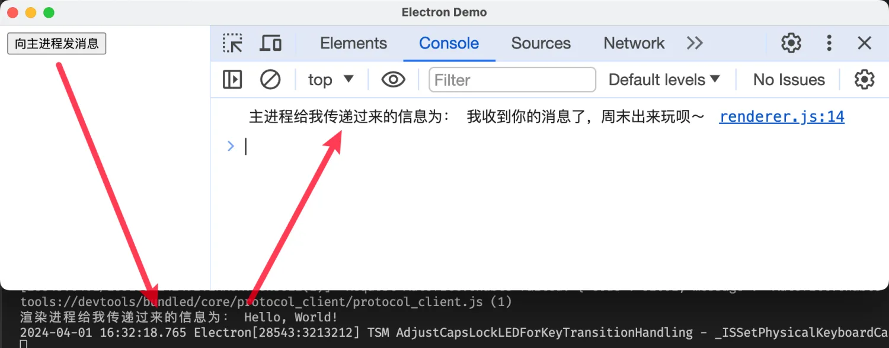

# [0004. 使用 web api MessageChannel 实现主进程和渲染进程之间的互相通信](https://github.com/Tdahuyou/electron/tree/main/0004.%20%E4%BD%BF%E7%94%A8%20web%20api%20MessageChannel%20%E5%AE%9E%E7%8E%B0%E4%B8%BB%E8%BF%9B%E7%A8%8B%E5%92%8C%E6%B8%B2%E6%9F%93%E8%BF%9B%E7%A8%8B%E4%B9%8B%E9%97%B4%E7%9A%84%E4%BA%92%E7%9B%B8%E9%80%9A%E4%BF%A1)

<!-- region:toc -->
- [1. 💻 demos.1 - 使用 web api MessageChannel 实现主进程和渲染进程之间的互相通信](#1--demos1---使用-web-api-messagechannel-实现主进程和渲染进程之间的互相通信)
<!-- endregion:toc -->

## 1. 💻 demos.1 - 使用 web api MessageChannel 实现主进程和渲染进程之间的互相通信

- 主进程有 MessageChannelMain 模块，渲染进程可以使用 Web API MessageChannel。
- 用哪个模块都可以实现通信的目的，差异在于通信的端口是在主进程生产还是在渲染进程生产。

::: code-group

```js [index.js]
const { app, BrowserWindow, ipcMain } = require('electron')

// 创建窗口方法
const createWindow = () => {
  const win = new BrowserWindow({
    width: 800,
    height: 600,
    webPreferences: {
      nodeIntegration: true,
      contextIsolation: false,
    },
  })

  win.loadFile('./index.html')

  win.webContents.openDevTools()
}

// whenReady 是一个生命周期方法，当 Electron 完成初始化后会调用这个方法
app.whenReady().then(() => {
  createWindow()
})

ipcMain.on('port', (event) => {
  // 拿到渲染进程给我传递过来的 port2
  const port = event.ports[0]

  port.on('message', (event) => {
    console.log('渲染进程给我传递过来的信息为：', event.data)
    port.postMessage('我收到你的消息了，周末出来玩呗～')
  })

  // 开启这个端口 - 这意味着两者之间可以进行通信了
  port.start()
})
```

```js [renderer.js]
// 
const { ipcRenderer } = require('electron')
const { port1, port2 } = new MessageChannel() // https://www.electronjs.org/zh/docs/latest/tutorial/message-ports/#messageports-in-the-main-process

// 需要将 port2 传递给主进程，这里通过 IPC 来进行传递。
/**
 * @param {string} channel 通道名，也就是说回头在主进程那边会监听这个名字的通道
 * @param {any} args 传递的参数，要传递给主进程的消息内容
 * @param {MessagePort[]} transferList 传递的 MessagePort 端口的数组
 */
ipcRenderer.postMessage('port', null, [port2])

// 监听 port1 的消息
port1.onmessage = (event) => {
  console.log('主进程给我传递过来的信息为：', event.data)
}

document.getElementById('btn').addEventListener('click', () => {
  // 向主进程发消息
  port1.postMessage('Hello, World!')
})
```

:::

**最终效果**

1. 在渲染进程点击按钮【向主进程发消息】
2. 主进程将收到一条消息【Hello, World!】
3. 主进程再给渲染进程回复一条消息【我收到你的消息了，周末出来玩呗～】


