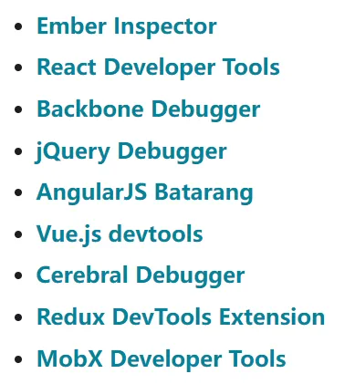
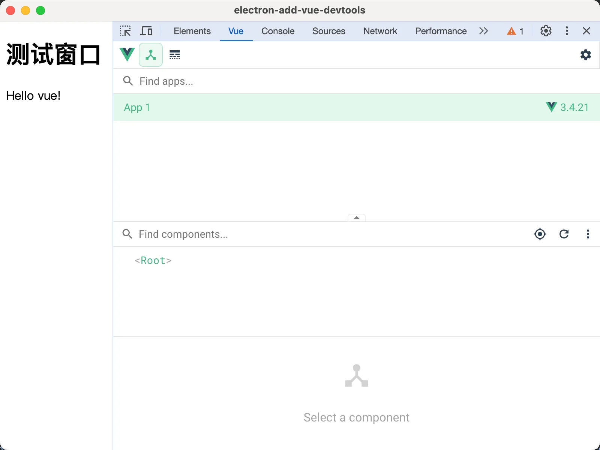

# [0007. 使用手动安装的方式集成 vue-devtools](https://github.com/Tdahuyou/electron/tree/main/0007.%20%E4%BD%BF%E7%94%A8%E6%89%8B%E5%8A%A8%E5%AE%89%E8%A3%85%E7%9A%84%E6%96%B9%E5%BC%8F%E9%9B%86%E6%88%90%20vue-devtools)

<!-- region:toc -->
<!-- endregion:toc -->
## 📝 Summary
- 如何通过 session 模块在 Electron 工程中集成 vue-devtools

## 🔗 links

- https://www.electronjs.org/zh/docs/latest/tutorial/devtools-extension
  - 查看 Electron 官方对于【开发者工具扩展】的相关说明，介绍了如何在 electron 中集成 chrome 插件及相关注意事项和问题，介绍了如何在 Electron 中管理开发者扩展工具。
    - 如何添加扩展工具
    - 如何删除扩展工具
  - 以下 DevTools 扩展程序已经通过测试，可以在 Electron 中正常工作。
    - 
- https://www.electronjs.org/zh/docs/latest/api/session#sesloadextensionpath-options
  - Electron，查看 session.defaultSession.loadExtension 这个接口的相关说明。
- https://github.com/vuejs/devtools
  - 这是 vue devtools 的 github 仓库，你可以从这里获取插件的源码。

## 💻 demo

```js
// index.js
const { app, BrowserWindow, session } = require('electron')
const path = require('path')

let win

function createWindow() {
  win = new BrowserWindow()
  win.loadFile('index.html')
  win.webContents.openDevTools()
}

app.whenReady().then(async () => {
  // 这里是手动下载下来的 Vue DevTools 扩展的本地路径。
  const devToolsPath = path.join(__dirname, './6.6.1_0')

  try {
    await session.defaultSession.loadExtension(
      devToolsPath,
      // allowFileAccess is required to load the devtools extension on file:// URLs.
      { allowFileAccess: true }
    )
    console.log('Vue DevTools loaded successfully.')
  } catch (err) {
    console.error('Failed to load Vue DevTools:', err)
  }

  createWindow()
})

app.on('activate', () => {
  if (BrowserWindow.getAllWindows().length === 0) createWindow()
})

app.on('window-all-closed', () => {
  if (process.platform !== 'darwin') app.quit()
})
```

```html
<!-- index.html -->
<!DOCTYPE html>
<html lang="en">
  <head>
    <meta charset="UTF-8" />
    <meta name="viewport" content="width=device-width, initial-scale=1.0" />
    <title>electron-add-vue-devtools</title>
  </head>
  <body>
    <h1>测试窗口</h1>
    <script src="https://unpkg.com/vue@3/dist/vue.global.js"></script>

    <div id="app">{{ message }}</div>

    <script>
      const { createApp, ref } = Vue

      createApp({
        setup() {
          const message = ref('Hello vue!')
          return {
            message,
          }
        },
      }).mount('#app')
    </script>
  </body>
</html>
```

**最终结果**

成功在 chrome devtools 中看到了 Vue 面板，这意味着已经成功地将 vue-devtools 集成进来了。


