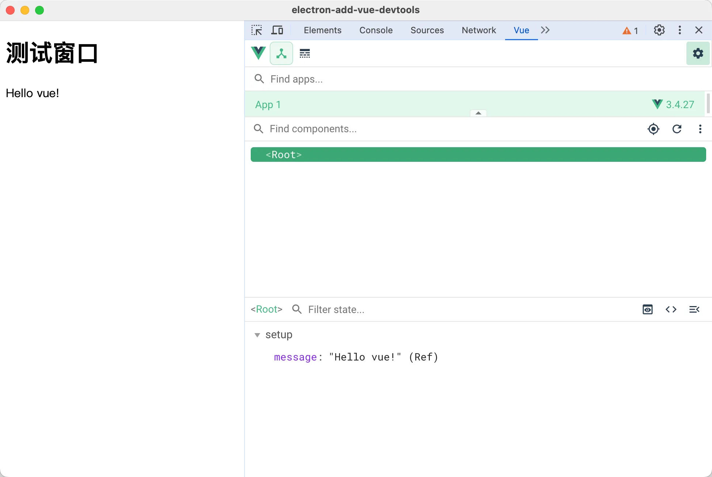
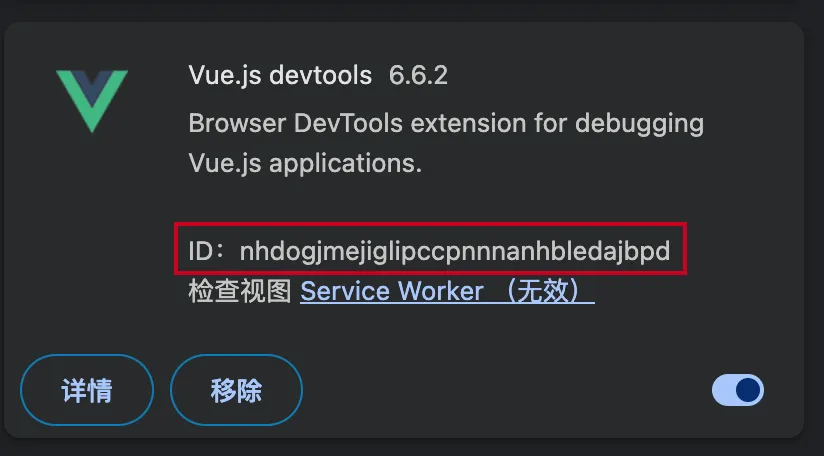
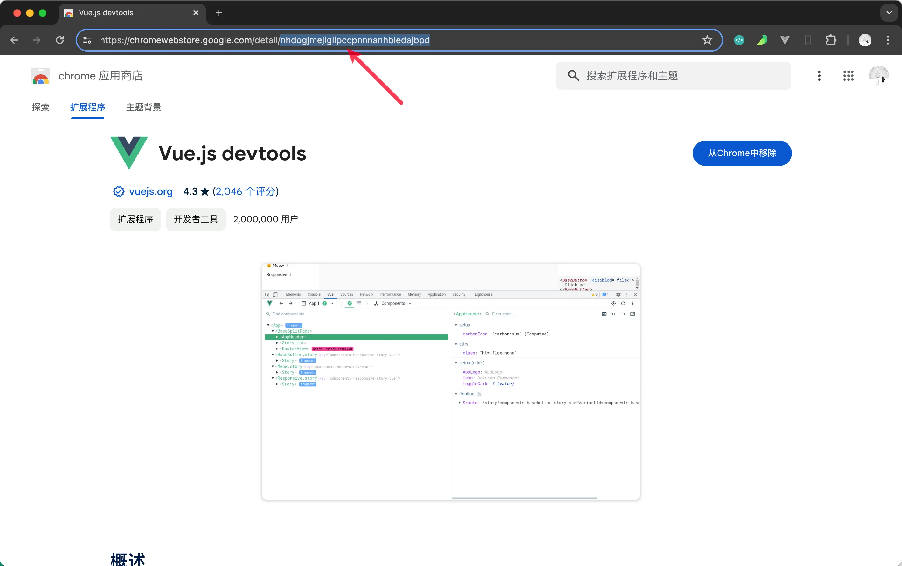

# [0008. 使用自动安装的方式集成 vue-devtools](https://github.com/Tdahuyou/electron/tree/main/0008.%20%E4%BD%BF%E7%94%A8%E8%87%AA%E5%8A%A8%E5%AE%89%E8%A3%85%E7%9A%84%E6%96%B9%E5%BC%8F%E9%9B%86%E6%88%90%20vue-devtools)

<!-- region:toc -->
- [1. 🔗 links](#1--links)
- [2. 💻 demo](#2--demo)
- [3. 📒 如何获取 VUE_DEVTOOLS_ID](#3--如何获取-vue_devtools_id)
<!-- endregion:toc -->
- 如何根据插件 ID 自动下载 chrome 插件源码 `downloadChromeExtension.js`
- 本文基于 electron-devtools-installer 中的下载 chrome 插件的逻辑，封装了一个 downloadChromeExtension.js 模块，在 electron.0007 的基础上，实现自动安装插件的功能。
- 其它第三方插件的集成方案基本都类似，集成 vue 调试工具 vue-devtools 的示例可以作为一个参考。

## 1. 🔗 links

- https://www.npmjs.com/package/electron-devtools-installer
  - electron-devtools-installer
- electron.0005
  - 这篇文档中尝试使用官方提供的 electron-devtools-installer 安装 vue-devtools 失败了，因此有了当前的这篇文档。文档中封装的 downloadChromeExtension.js 就是参考 electron-devtools-installer 实现的。
- electron.0007 使用手动安装的方式集成 vue-devtools
- https://chromewebstore.google.com/
  - chrome 应用商店
- https://chromewebstore.google.com/detail/vuejs-devtools/nhdogjmejiglipccpnnnanhbledajbpd
  - chrome extension - vue.js devtools

## 2. 💻 demo

```json
// package.json
{
  "name": "chrome-extension-downloader",
  "version": "1.0.0",
  "description": "",
  "main": "index.js",
  "scripts": {
    "test": "echo \"Error: no test specified\" && exit 1",
    "dev": "electron ."
  },
  "keywords": [],
  "author": "",
  "license": "ISC",
  "dependencies": {
    "electron": "^30.0.9",
    "rimraf": "^5.0.7",
    "unzip-crx-3": "^0.2.0"
  }
}
```

- rimraf：一个 Node.js 库，提供用于递归删除文件夹及其内容的功能，类似于 Unix 的 `rm -rf` 命令。
- unzip-crx-3：一个用于解压缩 Chrome 扩展（`.crx` 文件）的 Node.js 库，可以将扩展文件解压到指定目录。

```js
// downloadChromeExtension.js
const fs = require('fs')
const path = require('path')
const rimraf = require('rimraf')
const unzip = require('unzip-crx-3')
const { app, net } = require('electron')
const https = require('https')

// Utility functions
const getPath = () => {
  const savePath = app.getPath('userData')
  return path.resolve(`${savePath}/extensions`)
}

const request = net ? net.request : https.get

const downloadFile = (from, to) => {
  return new Promise((resolve, reject) => {
    const req = request(from)
    req.on('response', (res) => {
      if (
        res.statusCode &&
        res.statusCode >= 300 &&
        res.statusCode < 400 &&
        res.headers.location
      ) {
        return downloadFile(res.headers.location, to)
          .then(resolve)
          .catch(reject)
      }
      res.pipe(fs.createWriteStream(to)).on('close', resolve)
      res.on('error', reject)
    })
    req.on('error', reject)
    req.end()
  })
}

const changePermissions = (dir, mode) => {
  const files = fs.readdirSync(dir)
  files.forEach((file) => {
    const filePath = path.join(dir, file)
    fs.chmodSync(filePath, parseInt(`${mode}`, 8))
    if (fs.statSync(filePath).isDirectory()) {
      changePermissions(filePath, mode)
    }
  })
}

// Main function to download and install the Chrome extension
const downloadChromeExtension = (
  chromeStoreID,
  forceDownload = false,
  attempts = 5
) => {
  const extensionsStore = getPath()
  if (!fs.existsSync(extensionsStore)) {
    fs.mkdirSync(extensionsStore, { recursive: true })
  }

  const extensionFolder = path.resolve(`${extensionsStore}/${chromeStoreID}`)

  return new Promise((resolve, reject) => {
    if (!fs.existsSync(extensionFolder) || forceDownload) {
      if (fs.existsSync(extensionFolder)) {
        rimraf.sync(extensionFolder)
      }

      const fileURL = `https://clients2.google.com/service/update2/crx?response=redirect&acceptformat=crx2,crx3&x=id%3D${chromeStoreID}%26uc&prodversion=32` // eslint-disable-line
      const filePath = path.resolve(`${extensionFolder}.crx`)

      downloadFile(fileURL, filePath)
        .then(() => {
          unzip(filePath, extensionFolder)
            .then(() => {
              changePermissions(extensionFolder, 0o755)
              resolve(extensionFolder)
            })
            .catch((err) => {
              if (
                !fs.existsSync(path.resolve(extensionFolder, 'manifest.json'))
              ) {
                return reject(err)
              }
            })
        })
        .catch((err) => {
          console.log(
            `Failed to fetch extension, trying ${attempts - 1} more times`
          ) // eslint-disable-line
          if (attempts <= 1) {
            return reject(err)
          }
          setTimeout(() => {
            downloadChromeExtension(chromeStoreID, forceDownload, attempts - 1)
              .then(resolve)
              .catch(reject)
          }, 200)
        })
    } else {
      resolve(extensionFolder)
    }
  })
}

// #region test
// downloadChromeExtension('nhdogjmejiglipccpnnnanhbledajbpd')
//   .then((extensionFolder) => {
//     console.log(`Extension downloaded and installed at: ${extensionFolder}`)
//   })
//   .catch((err) => {
//     console.error('Failed to download and install extension:', err)
//   })
// #endregion test

module.exports = downloadChromeExtension
```

- **作用：**这个模块是用来下载和安装 Chrome 扩展的。
- **参数：**
  - `chromeStoreID`（Chrome 商店中扩展的 ID）
  - `forceDownload`（是否强制重新下载）
  - `attempts`（下载尝试的次数）
- **实现逻辑：**
  - 函数首先获取扩展的保存路径，并创建一个文件夹用于存储扩展。然后检查是否需要强制重新下载扩展，如果是，则删除旧的扩展文件夹。接下来，它使用 downloadFile 函数从指定的 URL 下载扩展文件，并将其保存为.crx 文件。
  - 下载完成后，使用 unzip 函数解压缩扩展文件，并设置正确的文件权限。最后，返回扩展文件夹的路径。
  - 如果下载或解压缩过程中出现错误，函数会尝试重新下载。它会记录尝试的次数，并在每次尝试失败后延迟 200 毫秒。
  - 模块中还包含一些工具函数，如 getPath（获取保存扩展的路径）、request（发起网络请求）、downloadFile（下载文件）、changePermissions（修改文件权限）等。
  - 模块的最后几行是一个示例，演示如何使用 downloadChromeExtension 函数来下载和安装扩展。
- **使用**

```js
const { app, BrowserWindow, session } = require('electron')
const downloadChromeExtension = require('./downloadChromeExtension')

const VUE_DEVTOOLS_ID = 'nhdogjmejiglipccpnnnanhbledajbpd'

let win

function createWindow() {
  win = new BrowserWindow()
  win.loadFile('index.html')
  win.webContents.openDevTools()
}

app.whenReady().then(async () => {
  try {
    const devToolsPath = await downloadChromeExtension(VUE_DEVTOOLS_ID);
    console.log(`Extension downloaded and installed at: ${devToolsPath}`);

    await session.defaultSession.loadExtension(devToolsPath, {
      allowFileAccess: true,
    });
    console.log('Vue DevTools loaded successfully.');
  } catch (err) {
    console.error('Failed to download and install extension:', err);
  }

  createWindow();

  app.on('activate', () => {
    if (BrowserWindow.getAllWindows().length === 0) createWindow();
  });
});

app.on('activate', () => {
  if (BrowserWindow.getAllWindows().length === 0) createWindow()
})

app.on('window-all-closed', () => {
  if (process.platform !== 'darwin') app.quit()
})
```

- **最终效果**
  - 

## 3. 📒 如何获取 VUE_DEVTOOLS_ID

去 **chrome 应用商店** 安装 **Vue.js devtools 插件**。假如你已经安装好了插件，可以在插件管理页面（`chrome://extensions/`）查看。



其实在插件安装的界面，URL 的末尾就是这个插件的 ID。




