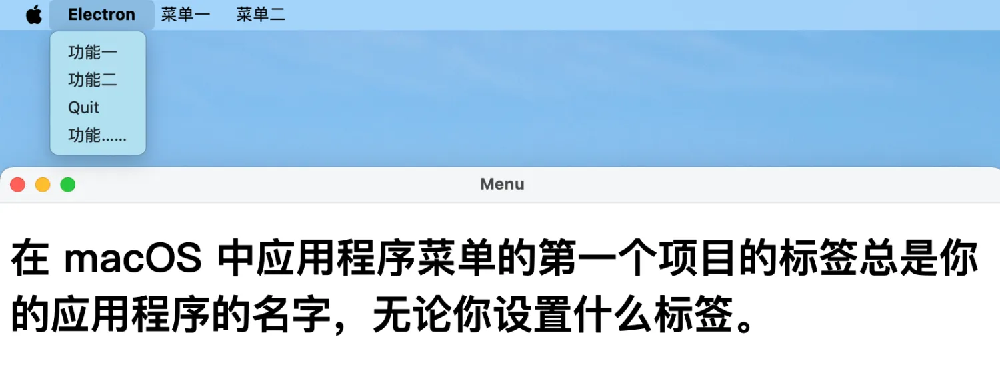

# [0010. macos 应用菜单第一项的问题](https://github.com/Tdahuyou/electron/tree/main/0010.%20macos%20%E5%BA%94%E7%94%A8%E8%8F%9C%E5%8D%95%E7%AC%AC%E4%B8%80%E9%A1%B9%E7%9A%84%E9%97%AE%E9%A2%98)

<!-- region:toc -->
- [bilibili.electron.0010.1](https://www.bilibili.com/video/BV1544219774)
- [1. 🔗 links](#1--links-7)
- [2. 💻 demo1](#2--demo1)
- [3. 💻 demo2](#3--demo2)
- [4. 🤔 问：在 macos 中，第一项菜单的名称如何自定义呢？](#4--问在-macos-中第一项菜单的名称如何自定义呢)
<!-- endregion:toc -->
- [📺 bilibili](https://www.bilibili.com/video/BV1544219774)
- macos 应用菜单第一项的有什么问题【demo1】
- 如何解决 macos 应用菜单第一项的有什么问题【demo2】
- 【demo1】介绍了 macos 应用菜单第一项的问题 —— 始终显示应用程序的名称，我们配置的 label 不生效。
- 【demo2】介绍了让我们配置的菜单项信息能够完整展示出来的一种解决方案 —— 对 macos 特殊处理，往菜单列表中 unshift 一项内容作为第一项。
- Q：实际开发中会存在这个问题吗？应该如何解决呢？
- A：不存在，解决方式也很简单。
- 在实际开发中会使用一些主流工具（比如 electron-builder）来出包，这时候 macos 菜单的第一项可以很方便地自定义配置，只需要配置 pageage.json 中的 productName 即可。

```json
{
  // ...
  "productName": "xxx", // 在这里配置你的应用名称
  // ...
}
```

## 1. 🔗 links

- https://developer.apple.com/library/archive/documentation/General/Reference/InfoPlistKeyReference/Articles/AboutInformationPropertyListFiles.html
  - Apple 开发者文档，About Information Property List Files，听说这篇文档介绍了如何修改【macos 应用菜单第一项展示的内容】的解决方案。
  - 未读过
- https://www.electronjs.org/zh/docs/latest/api/app#appgetname
  - Electron，查看 `app.getName()` 这个 API 的相关描述。
- https://www.electronjs.org/zh/docs/latest/api/menu-item
  - Electron，查看【菜单项】MenuItem 类的相关说明。
- https://www.yuque.com/huyouda/tools/0003#ghth2
  - `0003. WeRead 微信读书辅助脚本`

## 2. 💻 demo1

```js
// index.js
const {app, BrowserWindow, ipcMain, Menu} = require('electron')

let win
function createWindow() {
  win = new BrowserWindow()
  win.loadFile("./index.html")
}

function createMenu() {
  const template = [
    { label: '菜单一', submenu: [ { label: '功能一' }, { label: '功能二' } ] },
    { label: '菜单二', submenu: [ { label: '功能一' }, { label: '功能二' } ] }
  ];
  const menu = Menu.buildFromTemplate(template);
  Menu.setApplicationMenu(menu);
}

app.on('ready', () => {
  createWindow()
  createMenu()
})
```

**最终效果**


可以看到第一个菜单的标题是 Electron 而不是我们设置的标题 菜单一。这是因为 **在 macOS 中应用程序菜单的第一个项目的标签总是你的应用程序的名字，无论你设置什么标签。**

## 3. 💻 demo2

```js
// index.js
const { app, BrowserWindow, ipcMain, Menu } = require('electron')

let win
function createWindow() {
  win = new BrowserWindow()
  win.loadFile('./index.html')
}

function createMenu() {
  const template = [
    { label: '菜单一', submenu: [{ label: '功能一' }, { label: '功能二' }] },
    { label: '菜单二', submenu: [{ label: '功能一' }, { label: '功能二' }] },
  ]

  // 对 macos 特殊处理
  if (process.platform === 'darwin') {
    console.log('macos productName:', app.getName())
    template.unshift({
      // 在 macOS 中应用程序菜单的第一个项目的标签总是你的应用程序的名字，无论你设置什么标签。
      label: app.getName(),
      submenu: [
        { label: '功能一' },
        { label: '功能二' },
        {
          label: 'Quit',
          click() {
            app.quit()
          },
        },
        { label: '功能……' },
      ],
    })
  }

  const menu = Menu.buildFromTemplate(template)
  Menu.setApplicationMenu(menu)
}

app.on('ready', () => {
  createWindow()
  createMenu()
})
```

**最终效果**



## 4. 🤔 问：在 macos 中，第一项菜单的名称如何自定义呢？

- 在 Electron 应用程序中，如果你遇到了在 macOS 上菜单项始终显示为 "Electron" 的问题，这往往是因为在 macOS 中，应用的名称是通过应用的 `Info.plist` 文件定义的，而不仅仅是通过代码动态设置的。这意味着，尽管你在代码中使用 `app.getName()` 试图获取并设置应用的名称，实际显示的名称还是会回退到 `Info.plist` 中定义的名称。
- 解决这个问题的一种方法是修改你的 Electron 应用的 `package.json` 文件或是直接修改 `Info.plist` 文件，来确保应用的名称正确设置。在 `package.json` 中，你可以设置 `productName` 属性，这个属性值会在打包应用时被用来设置 `Info.plist` 中的 `CFBundleDisplayName` 和 `CFBundleName` 值。
- 当你使用 Electron 打包工具（如 `electron-packager` 或 `electron-builder`）打包应用时，`productName` 的值将被用来更新 `Info.plist`，从而确保 macOS 菜单上显示的是你设置的应用名称，而不是默认的 "Electron"。
- 以 `yuque--工具分享--0003. WeRead 微信读书辅助脚本` 为例，package.json 中的内容如下。

```json
{
  "name": "weread-helper",
  "productName": "微信读书助手",
  "version": "1.0.0",
  ...
}
```

如果你没有指定 productName，那么会读取 name 字段的信息。


如果你明确指定了 productName，那么会读取 productName 字段的信息。


