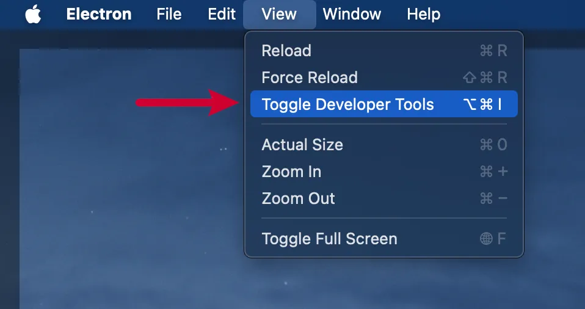
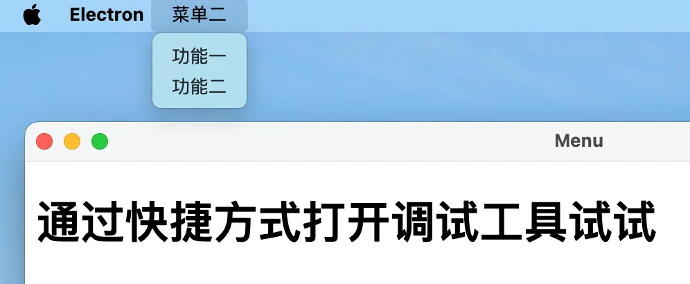

# [0011. 自定义系统菜单覆盖默认菜单问题](https://github.com/Tdahuyou/electron/tree/main/0011.%20%E8%87%AA%E5%AE%9A%E4%B9%89%E7%B3%BB%E7%BB%9F%E8%8F%9C%E5%8D%95%E8%A6%86%E7%9B%96%E9%BB%98%E8%AE%A4%E8%8F%9C%E5%8D%95%E9%97%AE%E9%A2%98)

<!-- region:toc -->
- [1. 🔗 links](#1--links)
- [2. 📒菜单项冲突问题](#2-菜单项冲突问题)
- [3. 📒如何解决冲突问题](#3-如何解决冲突问题)
- [4. 💻 demo1 - 手写调试工具切换的触发逻辑](#4--demo1---手写调试工具切换的触发逻辑)
- [5. 💻 demo2 - 使用预设的 role 来快速配置菜单项](#5--demo2---使用预设的-role-来快速配置菜单项)
- [6. 🤔 问：role 是什么？](#6--问role-是什么)
<!-- endregion:toc -->
- 自定义系统菜单和默认菜单的冲突问题是什么
- 如何解决冲突问题

## 1. 🔗 links

- https://www.electronjs.org/docs/latest/api/menu-item#roles
  - Electron 中内置了 role 字段，通过这个字段，你可以快速配置菜单项的功能。
  - 默认的系统菜单项还有不少，并没有每个都去尝试，不过其中类似“剪切”、“粘贴”、“复制”…… 等菜单项功能，其实可以通过 role 字段去快速配置。
- https://www.electronjs.org/docs/latest/api/menu#examples
  - An example of creating the application menu with the simple template API

## 2. 📒菜单项冲突问题

- 通过查看这部分内容，可以快速了解本文档要介绍的问题。
- 下面介绍一下这个 demo 的最终效果，需要解决的问题是什么。



- 如果没有自定义窗口菜单的话，那么你是可以通过快捷方式 `Opt Cmd I` 来快速打开开发者调试工具的。
- 现在，让我们来看看如果我们自定义的系统是下面这样的话，会导致什么问题。

```js
function createMenu() {
  const template = [
    { label: '菜单一', submenu: [{ label: '功能一' }, { label: '功能二' }] },
    { label: '菜单二', submenu: [{ label: '功能一' }, { label: '功能二' }] },
  ]

  const menu = Menu.buildFromTemplate(template)
  Menu.setApplicationMenu(menu)
}
```

- 此时，若你再通过 `Opt Cmd I` 这样的快捷方式来打开调试工具，会发现失效了，调试工具无法被唤起。



## 3. 📒如何解决冲突问题

- 原因很简单，因为系统自带的默认菜单被咱们指定的菜单给覆盖了。这其实就是该文档要介绍的点，如果咱们自定义的系统菜单覆盖了默认的菜单项，而默认的菜单项中的某些功能，恰好又正是我们需要的，要如何处理呢？
- 这时候的解决办法也非常简单 —— **缺啥补啥**
- 比如说，我们需要默认菜单项中的切换开发者工具的快捷方式，那么我们可以在自定义的菜单列表中把这一项给加上。

```js
function createMenu() {
  const template = [
    { label: '菜单一', submenu: [{ label: '功能一' }, { label: '功能二' }] },
    { label: '菜单二', submenu: [{ label: '功能一' }, { label: '功能二' }] },
    // 手动加上需要的功能
    {
      label: 'View',
      submenu: [
        {
          label: '切换开发者工具',
          accelerator: process.platform === 'darwin' ? 'Alt+Command+I' : 'Ctrl+Shift+I',
          click: (_, focusedWindow) => {
            if (focusedWindow) {
              focusedWindow.webContents.toggleDevTools()
            }
          },
        },
      ],
    },
  ]

  const menu = Menu.buildFromTemplate(template)
  Menu.setApplicationMenu(menu)
}
```


## 4. 💻 demo1 - 手写调试工具切换的触发逻辑

```js
// index.js
const { app, BrowserWindow, ipcMain, Menu } = require('electron')

let win
function createWindow() {
  win = new BrowserWindow()
  win.loadFile('./index.html')
}

function createMenu() {
  const template = [
    { label: '菜单一', submenu: [{ label: '功能一' }, { label: '功能二' }] },
    { label: '菜单二', submenu: [{ label: '功能一' }, { label: '功能二' }] },
    {
      label: 'View',
      submenu: [
        {
          label: '切换开发者工具',
          accelerator: process.platform === 'darwin' ? 'Alt+Command+I' : 'Ctrl+Shift+I',
          click: (_, focusedWindow) => {
            if (focusedWindow) {
              focusedWindow.webContents.toggleDevTools()
            }
          },
        },
      ]
    },
  ]

  // 对 macos 特殊处理
  if (process.platform === 'darwin') {
    template.unshift({
      label: app.getName(),
      submenu: [
        { label: '功能一' },
        { label: '功能二' },
        {
          label: 'Quit',
          click() {
            app.quit()
          },
        },
        { label: '功能……' },
      ],
    })
  }

  const menu = Menu.buildFromTemplate(template)
  Menu.setApplicationMenu(menu)
}

app.on('ready', () => {
  createWindow()
  createMenu()
})
```

## 5. 💻 demo2 - 使用预设的 role 来快速配置菜单项

> from: https://www.electronjs.org/docs/latest/api/menu#examples
>
> 这是来自 **官方** 的一个示例。

```js
const { app, BrowserWindow, Menu } = require('electron')

let win
function createWindow() {
  win = new BrowserWindow()
  win.loadFile('./index.html')
}

function createMenu() {
  const isMac = process.platform === 'darwin'

  const template = [
    // { role: 'appMenu' }
    ...(isMac
      ? [
          {
            label: app.name,
            submenu: [
              { role: 'about' },
              { type: 'separator' },
              { role: 'services' },
              { type: 'separator' },
              { role: 'hide' },
              { role: 'hideOthers' },
              { role: 'unhide' },
              { type: 'separator' },
              { role: 'quit' },
            ],
          },
        ]
      : []),
    // { role: 'fileMenu' }
    {
      label: 'File',
      submenu: [isMac ? { role: 'close' } : { role: 'quit' }],
    },
    // { role: 'editMenu' }
    {
      label: 'Edit',
      submenu: [
        { role: 'undo' },
        { role: 'redo' },
        { type: 'separator' },
        { role: 'cut' },
        { role: 'copy' },
        { role: 'paste' },
        ...(isMac
          ? [
              { role: 'pasteAndMatchStyle' },
              { role: 'delete' },
              { role: 'selectAll' },
              { type: 'separator' },
              {
                label: 'Speech',
                submenu: [{ role: 'startSpeaking' }, { role: 'stopSpeaking' }],
              },
            ]
          : [{ role: 'delete' }, { type: 'separator' }, { role: 'selectAll' }]),
      ],
    },
    // { role: 'viewMenu' }
    {
      label: 'View',
      submenu: [
        { role: 'reload' },
        { role: 'forceReload' },
        { role: 'toggleDevTools' },
        { type: 'separator' },
        { role: 'resetZoom' },
        { role: 'zoomIn' },
        { role: 'zoomOut' },
        { type: 'separator' },
        { role: 'togglefullscreen' },
      ],
    },
    // { role: 'windowMenu' }
    {
      label: 'Window',
      submenu: [
        { role: 'minimize' },
        { role: 'zoom' },
        ...(isMac
          ? [
              { type: 'separator' },
              { role: 'front' },
              { type: 'separator' },
              { role: 'window' },
            ]
          : [{ role: 'close' }]),
      ],
    },
    {
      role: 'help',
      submenu: [
        {
          label: 'Learn More',
          click: async () => {
            const { shell } = require('electron')
            await shell.openExternal('https://electronjs.org')
          },
        },
      ],
    },
  ]

  const menu = Menu.buildFromTemplate(template)
  Menu.setApplicationMenu(menu)
}

app.on('ready', () => {
  createWindow()
  createMenu()
})
```

## 6. 🤔 问：role 是什么？

- 在 Electron 中，菜单项的 role 字段是一个特殊的属性，它允许开发者为菜单项指定一个 预定义 的行为或角色。通过使用 role，你可以轻松添加一些常见的功能到你的应用菜单中，而不需要手动实现这些功能。这些角色覆盖了很多标准的菜单项行为，比如复制、粘贴、全选等，以及窗口、应用程序管理功能等。
- 使用 role 的优点
  - 简化开发：不需要编写额外的函数来处理常见的菜单功能。
  - 平台一致性：自动匹配并遵循用户操作系统的菜单行为和快捷键约定，确保了应用的原生体验。
  - 自动国际化：对应的菜单项会根据用户的操作系统语言自动翻译。
- 常见的 role 值
  - undo、redo：撤销和重做操作。
  - cut、copy、paste：剪切、复制、粘贴功能。
  - selectAll：选择全部文本或元素。
  - reload、forceReload：重新加载当前页面，强制重新加载忽略缓存。
  - toggleDevTools：切换开发者工具的显示状态。
  - quit：退出应用（通常在 macOS 上不使用，因为 macOS 应用通常不完全退出）。
  - minimize、close：最小化和关闭窗口。
- 如果你想添加一个复制功能的菜单项，而不是手动编写复制的逻辑，你可以简单地设置菜单项的 role 为 copy。

```js
{
  label: 'Copy',
  role: 'copy'
}
```

- 这会创建一个标签为 "Copy" 的菜单项，当被点击时执行操作系统的复制操作。通过利用 role，你可以更快速、高效地构建一个具有丰富功能的菜单，同时保持应用在不同平台上的一致性和原生体验。


