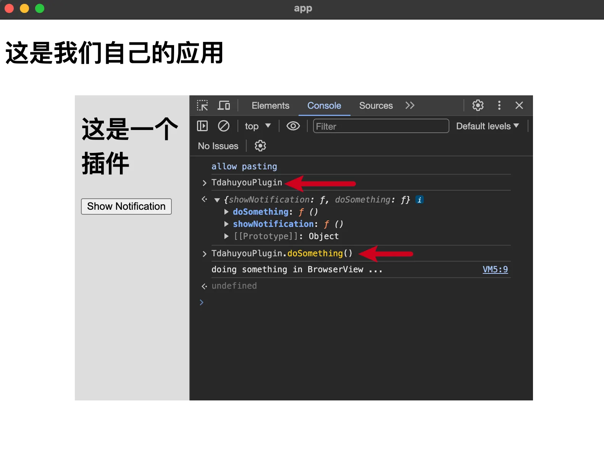

# [0013. 基于 BrowserView 实现插件化能力](https://github.com/Tdahuyou/electron/tree/main/0013.%20%E5%9F%BA%E4%BA%8E%20BrowserView%20%E5%AE%9E%E7%8E%B0%E6%8F%92%E4%BB%B6%E5%8C%96%E8%83%BD%E5%8A%9B)

<!-- region:toc -->
- [1. 📝 summary](#1--summary)
- [2. 🔗 links](#2--links)
- [3. 💻 demo - BrowserView 实现插件化](#3--demo---browserview-实现插件化)
<!-- endregion:toc -->

## 1. 📝 summary

- [📺 bilibili](https://www.bilibili.com/video/BV1544219774)
- 基于 BrowserView 实现插件化能力
- 该 demo 模拟了使用 BrowserView 模块来加载第三方资源并注入 preload 脚本，使其具备原生能力。

## 2. 🔗 links

- https://www.electronjs.org/zh/docs/latest/api/browser-view
  - Electron，查看有关 BrowserView 模块的相关描述。
- https://www.electronjs.org/zh/docs/latest/api/notification
  - Electron，查看主进程的 Notification 模块的相关说明。

## 3. 💻 demo - BrowserView 实现插件化

```bash
# 目录结构
$ tree -I node_modules
# .
# ├── index.html
# ├── index.js
# ├── package.json
# ├── plugin
# │   └── index.html
# └── preload.js
```

- 假设 plugin 目录下存放的是其他开发者基于咱们的应用开发的插件。插件可以通过我们暴露的指定 API 调用主窗口提供的封装好的功能来加强原生能力的支持。就像微信小程序提供的 JS SDK 一样，可以轻松使用小程序提供的原生、扩展能力的支持。

```js
// index.js
const { BrowserWindow, BrowserView, app, ipcMain, Notification } = require('electron')
const { join } = require('path')

let win, view
function createWindow() {
  win = new BrowserWindow({
    webPreferences: {
      width: 800,
      height: 600,
      nodeIntegration: false,
      contextIsolation: true,
    },
  })
  win.loadFile('./index.html')
  // win.webContents.openDevTools({ mode: 'detach' })
}

function createView() {
  view = new BrowserView({
    webPreferences: {
      nodeIntegration: false,
      contextIsolation: true,
      preload: join(__dirname, './preload.js'),
      // 通过 preload 来扩展插件的能力。
    },
  })

  win.setBrowserView(view)
  // 将插件挂载到窗口实例身上。
  view.setBounds({ x: 100, y: 100, width: 600, height: 400 })
  view.webContents.loadFile(join(__dirname, './plugin/index.html'))
  view.webContents.openDevTools()
}

function handleIPC() {
  ipcMain.on('TdahuyouPlugin-showNotification', (_, { title, body }) => {
    if (Notification.isSupported()) {
      const notification = new Notification({ title, body })
      notification.show()
    }
  })
}

app.whenReady().then(() => {
  createWindow()
  createView()
  handleIPC()
})
```

- `preload: join(__dirname, './preload.js')`，每个 `BrowserView` 或 `BrowserWindow` 都可以指定自己的预加载脚本，这意味着你可以为不同的视图暴露不同的 API，从而根据各自的上下文和安全需求灵活控制。
- `view.webContents.loadFile(join(__dirname, './plugin/index.html'))`，找到需要使用我们暴露的系统级 API 的插件入口，把它给加载进来。

```js
// preload.js
const { contextBridge, ipcRenderer } = require('electron')

const TdahuyouAPI = {
  showNotification: (opts) => { // { title: string, body: string, ... }
    ipcRenderer.send('TdahuyouPlugin-showNotification', { body: opts.body, title: opts.title })
  },
  doSomething: () => {
    console.log('doing something in BrowserView ...');
  }
  // other apis ...
}

if (process.contextIsolated) {
  contextBridge.exposeInMainWorld('TdahuyouPlugin', TdahuyouAPI)
} else {
  window.TdahuyouPlugin = TdahuyouAPI
}
```

- `const { contextBridge, ipcRenderer } = require('electron')` 在 preload 中，允许访问主进程的相关 API。
- `contextBridge.exposeInMainWorld('TdahuyouPlugin', TdahuyouAPI)`，在 preload 中，我们可以将那些需要暴露给插件使用的 API 通过 `contextBridge` 丢给插件使用，API 的名称由我们自行指定。

```html
<!-- index.html -->
<!DOCTYPE html>
<html lang="en">
<head>
  <meta charset="UTF-8">
  <meta name="viewport" content="width=device-width, initial-scale=1.0">
  <title>app</title>
</head>
<body>
  <h1>这是我们自己的应用</h1>
</body>
</html>
```

```html
<!-- plugin/index.html -->
<!DOCTYPE html>
<html lang="en">
<head>
  <meta charset="UTF-8">
  <meta name="viewport" content="width=device-width, initial-scale=1.0">
  <title>插件</title>
  <style>
    body {
      background-color: #ddd;
    }
  </style>
</head>
<body>
  <h1>这是一个插件</h1>
  <button id="btn">Show Notification</button>

  <script>
    document.getElementById('btn').addEventListener('click', () => {
      TdahuyouPlugin.showNotification({ title: '提示的标题', body: '提示的内容' })
    })
  </script>
</body>
</html>
```

- `TdahuyouPlugin.showNotification({ title: '提示的标题', body: '提示的内容' })`，在 preload 中指定了 API 的名称为 TdahuyouPlugin，用户在使用的时候可以通过这个全局对象访问到那些我们在 preload 中丢到 TdahuyouPlugin 里边的内容。

**最终效果**



点击按钮【Show Notification】将会弹出系统消息。

