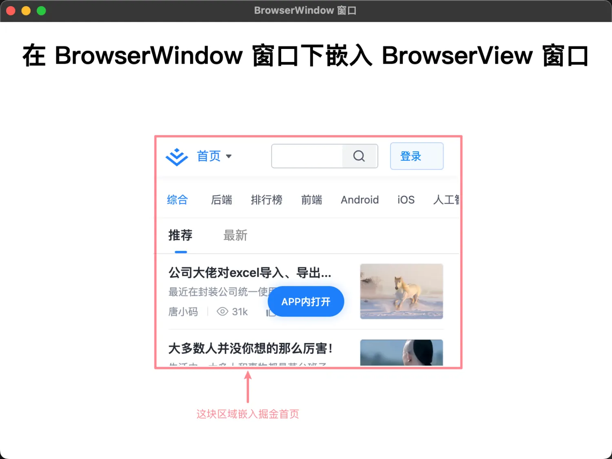

# [0014. 使用 BrowserView 加载外部资源](https://github.com/Tdahuyou/electron/tree/main/0014.%20%E4%BD%BF%E7%94%A8%20BrowserView%20%E5%8A%A0%E8%BD%BD%E5%A4%96%E9%83%A8%E8%B5%84%E6%BA%90)

<!-- region:toc -->
- [1. ⏰ TODO 为啥 BrowserView 被废弃掉了](#1--todo-为啥-browserview-被废弃掉了)
- [2. 🔗 links](#2--links)
- [3. 💻 demo](#3--demo-1)
<!-- endregion:toc -->
- [📺 bilibili](https://www.bilibili.com/video/BV1544219774)
- 如何使用 BrowserView 加载外部资源
- 这个 demo 使用 BrowserView 模块来加载第三方资源（掘金主页）到渲染进程的页面上。

## 1. ⏰ TODO 为啥 BrowserView 被废弃掉了

- 注意，最新版的 Electron，已经将 BrowserView 这个 API 被标注为 Deprecated。这个稍微注意下，找时间看看是啥情况，为啥 BrowserView 被废弃掉了。

## 2. 🔗 links

- https://www.electronjs.org/zh/docs/latest/api/browser-view
  - Electron，查看有关 BrowserView 模块的相关描述。
- https://www.electronjs.org/zh/docs/latest/api/browser-window#winsetbrowserviewbrowserview-experimental-deprecated
  - 查看 win.setBrowserView(browserView) 接口说明文档。注意：这 API 已经不再被推荐使用了。

## 3. 💻 demo

```js
// index.js
const { app, BrowserView, BrowserWindow } = require('electron')

app.whenReady().then(() => {
  const win = new BrowserWindow({ width: 800, height: 600 })
  win.loadFile('./index.html')

  const view = new BrowserView()
  win.setBrowserView(view)
  view.setBounds({ x: 200, y: 150, width: 400, height: 300 })
  view.webContents.loadURL('https://juejin.cn')
})
```

- `const view = new BrowserView()` 创建子窗口。
- `win.setBrowserView(view)` 在 win 窗口中嵌入子窗口 view。
- `view.setBounds({ x: 200, y: 150, width: 400, height: 300 })`
  - 设置 x，y 坐标，窗口宽度和高度。
  - 让子窗口居中展示出来。
- `view.webContents.loadURL('https://juejin.cn')` 加载页面。

```html
<!-- index.html -->
<!DOCTYPE html>
<html lang="en">
<head>
  <meta charset="UTF-8">
  <meta name="viewport" content="width=device-width, initial-scale=1.0">
  <title>BrowserWindow 窗口</title>
</head>
<body>
   <h1 style="text-align: center;">在 BrowserWindow 窗口下嵌入 BrowserView 窗口</h1>
</body>
</html>
```

**最终效果**

在我们本地的 index.html 渲染进程中，嵌入了一个 https://juejin.cn/ 窗口。




