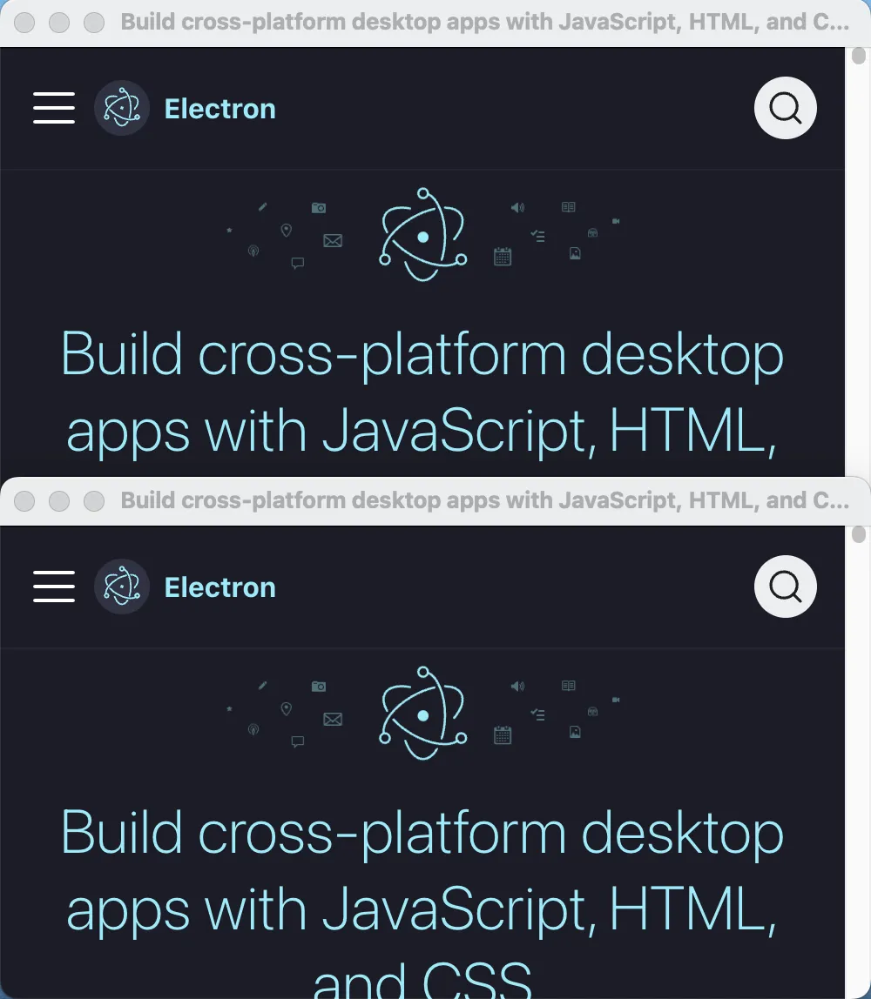

# [0015. 等 ready-to-show 事件触发后再显示窗口以解决窗口白屏问题](https://github.com/Tdahuyou/electron/tree/main/0015.%20%E7%AD%89%20ready-to-show%20%E4%BA%8B%E4%BB%B6%E8%A7%A6%E5%8F%91%E5%90%8E%E5%86%8D%E6%98%BE%E7%A4%BA%E7%AA%97%E5%8F%A3%E4%BB%A5%E8%A7%A3%E5%86%B3%E7%AA%97%E5%8F%A3%E7%99%BD%E5%B1%8F%E9%97%AE%E9%A2%98)

<!-- region:toc -->
- [1. 🔗 links](#1--links-11)
- [2. 💻 demo](#2--demo-6)
<!-- endregion:toc -->
- 白屏问题是很经典的一个常见问题，处理方案：
  - 优先展示主题色的全屏背景
  - 使用骨架屏
  - 等一切就绪再 show【本文介绍的方法】

## 1. 🔗 links

- https://www.electronjs.org/zh/docs/latest/api/browser-window#%E4%BC%98%E9%9B%85%E5%9C%B0%E6%98%BE%E7%A4%BA%E7%AA%97%E5%8F%A3
  - 使用 ready-to-show 事件实现优雅地显示窗口，解决闪屏的问题。
- https://www.electronjs.org/zh/docs/latest/api/browser-window#%E4%BA%8B%E4%BB%B6-ready-to-show
  - 查看有关 ready-to-show 事件的描述。

## 2. 💻 demo

```js
// index.js
const { app, BrowserWindow } = require('electron')

let win1
let win2
function createWindow() {
  win1 = new BrowserWindow({ x: 0, y: 0, height: 300, width: 500 })
  win2 = new BrowserWindow({ x: 0, y: 300, height: 300, width: 500, show: false })

  win1.loadURL('https://www.electronjs.org/')
  win2.loadURL('https://www.electronjs.org/')

  win2.on('ready-to-show', win2.show)
}

app.whenReady().then(() => {
  createWindow()
})
```

- `win2 = new BrowserWindow({ x: 0, y: 300, height: 300, width: 500, show: false }) `
  - `y: 300` 让 win2 窗口的位置向下偏移 300，相当于在 win1 窗口下边显示。
  - `show:false` 让 win2 窗口创建完之后处于不可见的状态。
- `win1.loadURL('https://www.electronjs.org/')`、`win2.loadURL('https://www.electronjs.org/')`
  - 让 win1、win2 加载同一个站点，控制一下变量，以便测试。
- `win2.on('ready-to-show', win2.show)`
  - 当 ready-to-show 事件触发后再调用 `win2.show()` 展示窗口。
  - Electron 中的 ready-to-show 事件表示窗口内容已经加载完成且应用程序准备好显示给用户。在等待 ready-to-show 事件触发后再调用 `window.show()`，可以确保用户看到的是完全加载并准备好的界面，避免了展示未完成的内容。

**最终效果**



仔细观察会发现 win1 窗口会先于 win2 窗口展示出来，即便 win1 窗口的内容还没加载完成，还没有触发 ready-to-show。

可以将加载的 URL 改成其它测试站点，那些内容比较多，加载耗时比较长的站点，这样对比的效果会更为明显。


