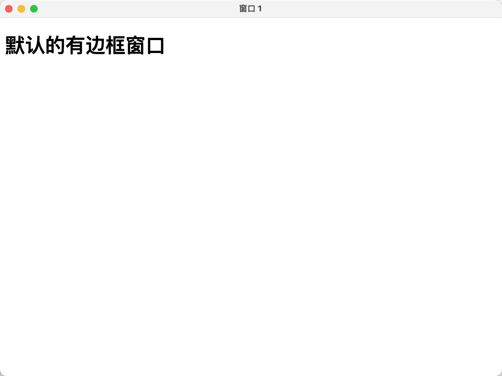
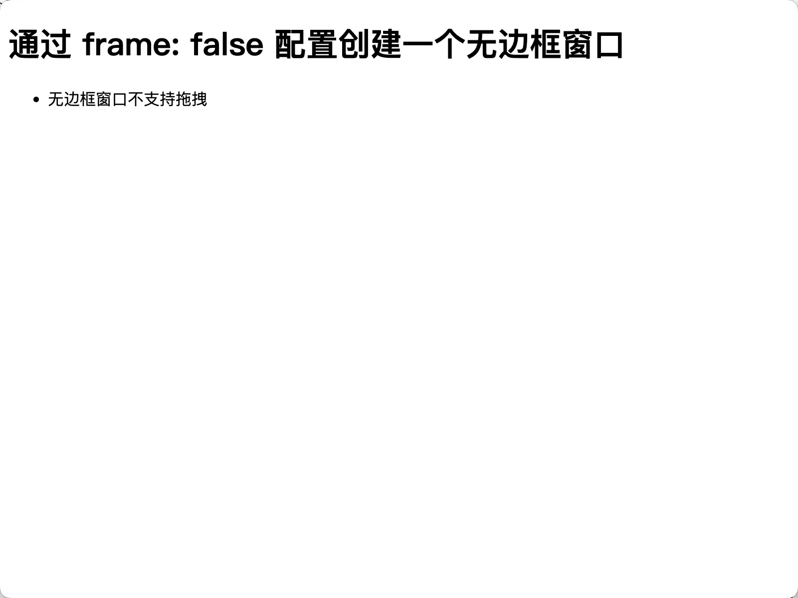

# [0018. 创建一个无边框窗口](https://github.com/Tdahuyou/electron/tree/main/0018.%20%E5%88%9B%E5%BB%BA%E4%B8%80%E4%B8%AA%E6%97%A0%E8%BE%B9%E6%A1%86%E7%AA%97%E5%8F%A3)

<!-- region:toc -->
- [1. 📝 summary](#1--summary)
- [2. 📺 bilibili](#2--bilibili)
- [3. 🔗 links](#3--links)
- [4. 💻 demo](#4--demo)
<!-- endregion:toc -->
## 1. 📝 summary

- 创建无边框窗口 frame: false
- 无边框窗口的特点

## 2. 📺 bilibili

- https://www.bilibili.com/video/BV1544219774
  - electron.0018

## 3. 🔗 links

- https://www.electronjs.org/zh/docs/latest/tutorial/window-customization
  - 官方文档，自定义窗口，查看官方文档中对于如何创建【自定义窗口】的描述。
- https://www.electronjs.org/docs/latest/api/structures/browser-window-options
  - 官方文档，查看创建 BrowserWindow 实例的相关配置项 options。

## 4. 💻 demo

```js
// index.js
const { BrowserWindow, app } = require('electron')

let win, win_without_frame
function createWindow() {
  win = new BrowserWindow()
  win_without_frame = new BrowserWindow({ frame: false })

  win.loadFile('./index.html')
  win_without_frame.loadFile('./index_without_frame.html')
}

app.whenReady().then(createWindow)
```

- `frame: false` 去掉窗口默认自带的边框，也就是去掉标题栏部分。

```html
<!-- index.html -->
<!DOCTYPE html>
<html lang="en">
<head>
  <meta charset="UTF-8">
  <meta name="viewport" content="width=device-width, initial-scale=1.0">
  <title>窗口 1</title>
</head>
<body>
  <h1>默认的有边框窗口</h1>
</body>
</html>
```

```html
<!-- index_without_frame.html -->
<!DOCTYPE html>
<html lang="en">
<head>
  <meta charset="UTF-8">
  <meta name="viewport" content="width=device-width, initial-scale=1.0">
  <title>无边框窗口</title>
</head>
<body>
  <h1>通过 frame: false 配置创建一个无边框窗口</h1>
  <ul>
    <li>无边框窗口不支持拖拽</li>
  </ul>
</body>
</html>
```

- `<title>无边框窗口</title>` 这一部分是没有意义的，因为窗口无边框，这个标题压根就不会显示出来。

**最终效果**

- 
- 