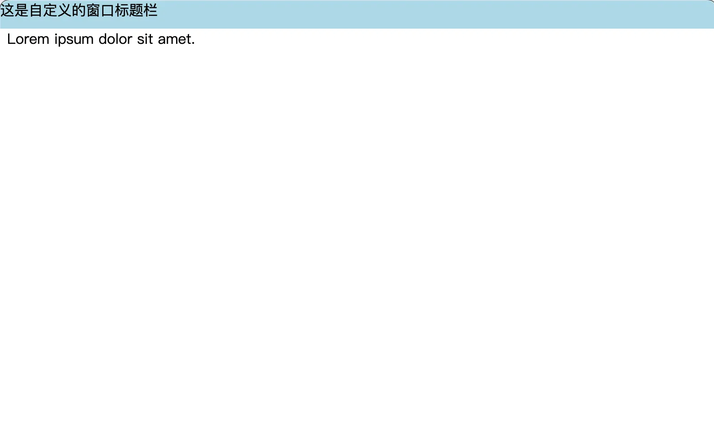

# [0019. 让无边框的窗口可以被拖拽](https://github.com/Tdahuyou/electron/tree/main/0019.%20%E8%AE%A9%E6%97%A0%E8%BE%B9%E6%A1%86%E7%9A%84%E7%AA%97%E5%8F%A3%E5%8F%AF%E4%BB%A5%E8%A2%AB%E6%8B%96%E6%8B%BD)

- 📝 summary
  - 通过 css 来解决无边框的窗口的拖拽问题

## 🔗 links

- https://www.electronjs.org/zh/docs/latest/tutorial/window-customization#%E8%AE%BE%E7%BD%AE%E8%87%AA%E5%AE%9A%E4%B9%89%E5%8F%AF%E6%8B%96%E5%8A%A8%E5%8C%BA%E5%9F%9F
  - 官方文档，设置自定义可拖动区域，这是官方文档中对无边框窗口的一些介绍。

## 💻 demo

```js
// index.js
const { BrowserWindow, app } = require('electron')

let win
function createWindow() {
  win = new BrowserWindow({ frame: false })
  win.loadFile('./index.html')
}

app.whenReady().then(createWindow)
```


```html
<!-- index.html -->
<!DOCTYPE html>
<html lang="en">
  <head>
    <meta charset="UTF-8" />
    <meta name="viewport" content="width=device-width, initial-scale=1.0" />
    <link rel="stylesheet" href="./index.css" />
    <title>无边框窗口</title>
  </head>
  <body>
    <!-- 令窗口的标题栏是可拖拽的区域 -->
    <div class="title">这是自定义的窗口标题栏</div>
    <!-- 窗口的内容区域不可拖拽 -->
    <div class="content">Lorem ipsum dolor sit amet.</div>
  </body>
</html>
```


```css
/* index.css */
.title {
  position: fixed;
  top: 0;
  left: 0;
  right: 0;
  height: 2rem;
  background-color: lightblue;

  /* 使该区域可拖拽 */
  -webkit-app-region: drag;
}

.content {
  margin-top: 2rem;
}
```

- 应用程序需要在 CSS 中指定 `-webkit-app-region: drag` 来告诉 Electron 哪些区域是可拖拽的（如操作系统的标准标题栏），当前只支持矩形形状区域。
- 在某区域使用 `-webkit-app-region: drag` 来设置拖拽，那么请记住需要在可拖拽区域内部使用 `-webkit-app-region: no-drag` 来将其中部分需要交互的区域排除。不然那些需要交互的元素将无法响应鼠标事件，比如点击。
- 使用 css 来解决无边框窗口的拖拽问题，是一种比较常见的做法，除了写法简洁这一点好处之外，还可以正常实现窗口的一些交互行为，比如双击标题栏区域，实现窗口的最大化切换。当然，也会存在一些弊端，主要提现在点击行为的交互上 —— **click 事件失效**。

```js
// test title can be clicked
// 通过 css 的方式来解决无边框窗口的拖拽问题，会导致点击事件失效。
const title = document.querySelector('.title')
title.addEventListener('click', () => {
  console.log('title clicked')
})
// 点击内容区域，可以触发点击事件。
const content = document.querySelector('.content')
content.addEventListener('click', () => {
  console.log('content clicked')
})
```

- 点击标题栏 `.title`，并不会打印 `title clicked`。
- 点击内容区域 `.content`，会打印 `content clicked`。

**最终效果**

点击蓝底的标题栏区域，可以拖动窗口。

