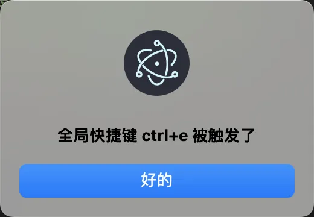

# [0022. 全局级别的快捷键](https://github.com/Tdahuyou/electron/tree/main/0022.%20%E5%85%A8%E5%B1%80%E7%BA%A7%E5%88%AB%E7%9A%84%E5%BF%AB%E6%8D%B7%E9%94%AE)

<!-- region:toc -->
<!-- endregion:toc -->
## 📝 Summary
- 如何注册全局（系统）级别的快捷方式

## 🔗 links

- https://www.electronjs.org/zh/docs/latest/api/global-shortcut
  - Electron，查看 globalShortcut 模块的相关描述。

## 📒 notes

- 全局级别的快捷键，也称系统级别的快捷键，这玩意儿在很多桌面应用程序中多多少少都会有一些。对于一些常用的操作和交互行为，绑定好快捷键，还是蛮必要的。
- globalShortcut 是一个主进程中的模块，其作用是 在应用程序没有键盘焦点时，监听键盘事件。
- Q：什么叫“应用程序没有键盘焦点”？
- A：就是你当前鼠标点击的位置并非该应用，焦点不在这个应用身上。

## 💻 demo

```js
// index.js
const { globalShortcut, app, dialog } = require('electron')

app.on('ready', () => {
  // 需要注意，在注册全局快捷键的时候，需要在 app 模块的 ready 事件触发之后
  // 使用 globalShortcut.register 方法注册之后会有一个返回值
  // 这个返回值是一个布尔值，如果为 true 则表示注册成功，否则表示注册失败
  const ret = globalShortcut.register('ctrl+e', () => {
    dialog.showMessageBox({
      message: '全局快捷键 ctrl+e 被触发了',
      buttons: ['好的'],
    })
  })

  // 通过返回值来判断是否注册成功
  if (!ret) {
    console.error('注册失败')
  } else {
    console.log('注册成功')
  }

  console.log(
    // 通过 isRegistered 方法来判断是否注册成功
    globalShortcut.isRegistered('ctrl+e')
      ? '全局快捷键注册成功'
      : '全局快捷键注册失败'
  )
})

// 当我们注册了全局快捷键之后，当应用程序退出的时候，也需要注销这个快捷键
app.on('will-quit', function () {
  globalShortcut.unregister('ctrl+e')
  // globalShortcut.unregisterAll()
})
```

- 注册快捷方式
  - `globalShortcut.register('ctrl+e', fn)` 需要在应用 ready 之后才能注册全局快捷键，注册快捷键使用 `globalShortcut.register` 这个 API 来实现注册。
- 判断是否注册成功
  - `globalShortcut.register` 的返回结果是一个 boolean 值，表示是否注册成功。
- 判断某个快捷方式是否已经完成注册
  - 通过 `globalShortcut.isRegistered('ctrl+e')` 可以检查某个全局快捷键是否已经被注册。
- 注销快捷方式
  - 当应用退出的时候，需要注销所注册的全局快捷键，使用 `globalShortcut.unregister('ctrl+e')` 注销指定的快捷键。也可以粗暴点儿直接使用 `globalShortcut.unregisterAll()` 把所有快捷方式都给注销。

**最终效果**

- 使用 `npm run dev` 启动应用后，会在终端打印一些额外信息，帮助理解程序的运行。
  - 
- 按下 `ctrl + e` 即可触发系统弹框。
  - 
- 需要注意的是，这个 demo 并没有实际的窗口，但是这并不妨碍全局快捷键的注册。