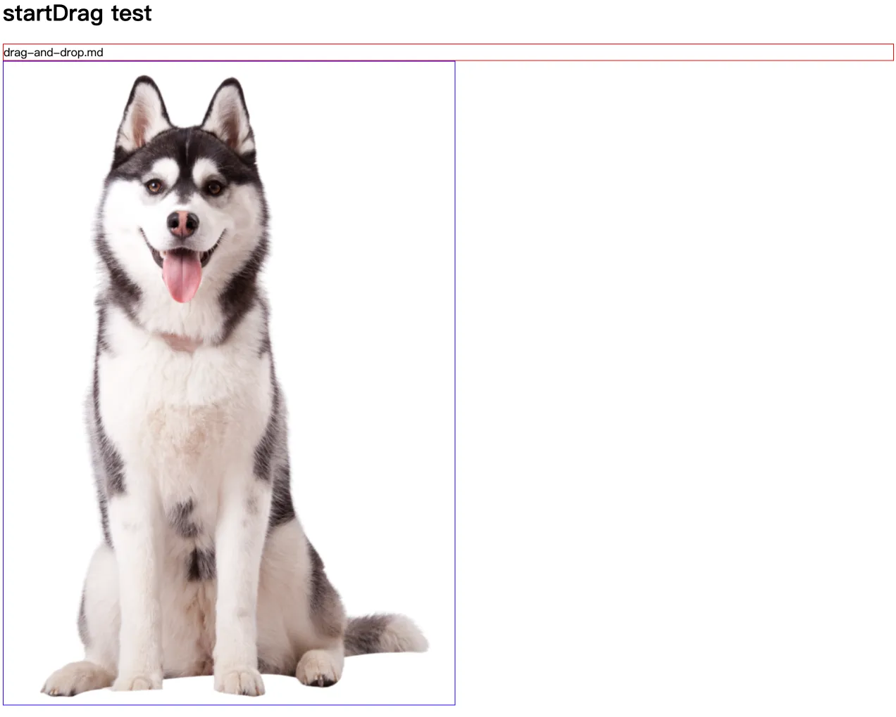

# [0027. 原生文件拖 & 放](https://github.com/Tdahuyou/electron/tree/main/0027.%20%E5%8E%9F%E7%94%9F%E6%96%87%E4%BB%B6%E6%8B%96%20%26%20%E6%94%BE)

<!-- region:toc -->
- [1. 📝 summary](#1--summary)
- [2. 🔗 links](#2--links)
- [3. 📒本文要实现一个什么样的效果](#3-本文要实现一个什么样的效果)
- [4. 💻 demo](#4--demo)
<!-- endregion:toc -->
## 1. 📝 summary

- [📺 bilibili](https://www.bilibili.com/video/BV1544219774)
- 原生文件拖 & 放是什么
- 如何实现原生文件拖 & 放效果
  - 从视频的 0:50～2:30 开始展示最终的效果，可以从这开始看，快速了解下本节要实现的效果。

## 2. 🔗 links

- https://www.electronjs.org/zh/docs/latest/api/web-contents#contentsstartdragitem
  - 查看官方文档对于 API - contents.startDrag(item) 的介绍。
- https://www.electronjs.org/zh/docs/latest/tutorial/native-file-drag-drop
  - 查看官方示例 - 原生文件拖 & 放。

## 3. 📒本文要实现一个什么样的效果

- 
  - 可以直接将窗口中的红框或蓝框中的内容，直接拖到系统桌面或者指定文件夹中。
  - 从视频的 `0:50～2:30` 开始展示最终的效果，可以从这开始看，快速了解下本节要实现的效果。
  - 这是一个很实用的一个功能点，在做一些效率工具的时候可以考虑加上这个功能点。

## 4. 💻 demo

```bash
# 目录结构
├── drag-and-drop.md # 被拖动的文本文件示例
├── drag-and-drop.png # 被拖动的图片文件示例
├── iconForDragAndDrop.png # 拖拽时显示在鼠标指针上的图像
├── index.html
├── index.js
├── package.json
├── preload.js
└── renderer.js
```

```js
// index.js
const { app, BrowserWindow, ipcMain } = require('electron/main')
const path = require('node:path')

let win
function createWindow() {
  win = new BrowserWindow({
    width: 800,
    height: 600,
    webPreferences: {
      nodeIntegration: true,
      preload: path.join(__dirname, 'preload.js'),
    },
  })

  win.loadFile('index.html')
}

app.whenReady().then(createWindow)

ipcMain.on('ondragstart', (event, filePath) => {

  console.log('event.sender === win.webContents =>', event.sender === win.webContents) // true
  console.log('filePath =>', filePath)
  // event.sender === win.webContents => true
  // filePath => /Users/huyouda/Desktop/【demo】原生文件拖 & 放/drag-and-drop.md

  event.sender.startDrag({
    file: filePath,
    icon: path.join(__dirname, 'iconForDragAndDrop.png'),
  })
})

app.on('window-all-closed', () => {
  if (process.platform !== 'darwin') {
    app.quit()
  }
})

app.on('activate', () => {
  if (BrowserWindow.getAllWindows().length === 0) {
    createWindow()
  }
})
```

```js
// preload.js
const { contextBridge, ipcRenderer } = require('electron')
const path = require('node:path')

contextBridge.exposeInMainWorld('electron', {
  startDrag: (fileName) => {

    console.log('process.cwd() =>', process.cwd())
    // process.cwd() => /Users/huyouda/Desktop/【demo】原生文件拖 & 放
    // 返回值是 Node.js 进程的当前工作目录，也就是这个 demo 所在的文件夹的绝对路径。

    ipcRenderer.send('ondragstart', path.join(process.cwd(), fileName))
  },
})
```

```html
<!-- index.html -->
<!DOCTYPE html>
<html lang="en">
  <head>
    <meta charset="UTF-8" />
    <meta name="viewport" content="width=device-width, initial-scale=1.0" />
    <style>
      #drag1, #drag2 {
        border: 1px solid;
      }

      #drag1 {
        border-color: red;
      }

      #drag2 {
        border-color: blue;
      }
    </style>
    <title>【demo】原生文件拖 & 放</title>
  </head>
  <body>
    <h1>startDrag test</h1>
    <div draggable="true" id="drag1">drag-and-drop.md</div>
    
    <script src="renderer.js"></script>
  </body>
</html>
```

```js
document.getElementById('drag1').ondragstart = (event) => {
  event.preventDefault()
  window.electron.startDrag('drag-and-drop.md')
}

document.getElementById('drag2').ondragstart = (event) => {
  event.preventDefault()
  window.electron.startDrag('drag-and-drop.png')
}
```

- `event.preventDefault()` 当你拖动一个元素时，浏览器通常会执行默认的拖拽操作，比如显示拖动中的预览图像或在文件拖动过程中显示文件名。通过调用 `event.preventDefault()`，你可以防止这些默认操作，并自定义拖拽行为。

