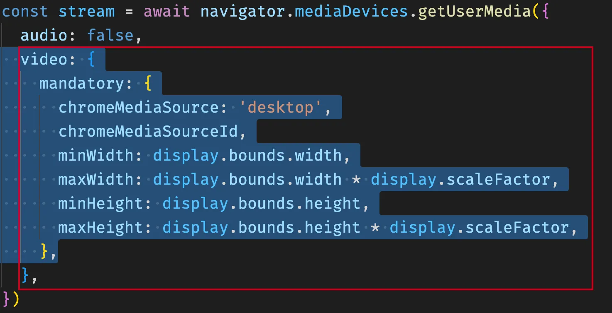
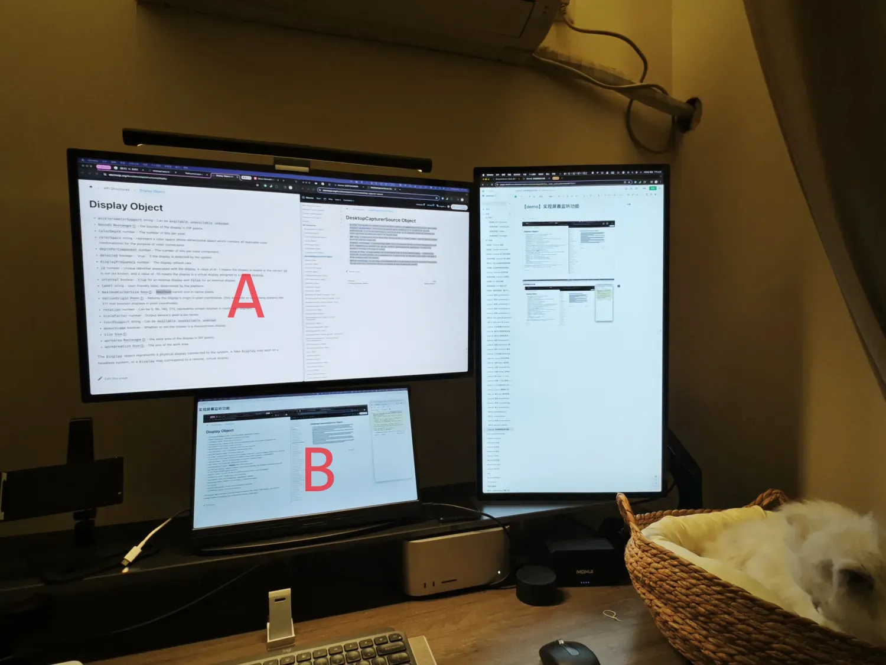
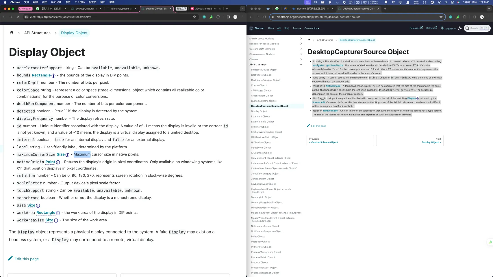
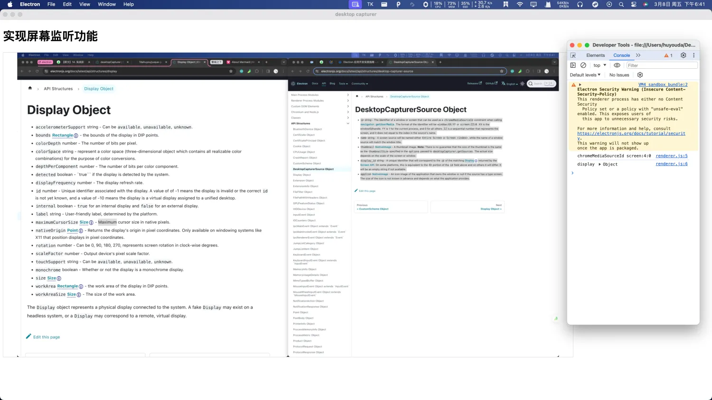

# [0029. 实现屏幕监听功能](https://github.com/Tdahuyou/electron/tree/main/0029.%20%E5%AE%9E%E7%8E%B0%E5%B1%8F%E5%B9%95%E7%9B%91%E5%90%AC%E5%8A%9F%E8%83%BD)

- 这是参照官方示例实现一个屏幕实时监听的 demo。

## 🔗 links

- https://www.electronjs.org/docs/latest/api/desktop-capturer
  - Electron，查看主进程的 desktopCapturer API 的相关描述。
- https://www.electronjs.org/zh/docs/latest/api/screen
  - Electron，查看主进程模块 `screen` 的相关说明。
- https://www.electronjs.org/zh/docs/latest/api/structures/desktop-capturer-source
  - Electron，查看 DesktopCapturerSource 对象结构详情，`desktopCapturer` 的返回值类型是 `Promise<DesktopCapturerSource[]>`。
- https://developer.mozilla.org/zh-CN/docs/Web/API/MediaDevices/getUserMedia
  - MDN，查看 WebRTC API - `MediaDevices.getUserMedia()` 的相关说明。仅作为一个参考即可，还是以 Electron 官方的写法为准。（这玩意儿要求的参数结构和官方示例中的结构不一致。）
- https://github.com/electron/electron/issues/27139
  - Electron Github Issues，mandatory property missing from MediaTrackConstraints #27139。
  - 主要讨论了在使用 Electron 的 desktopCapturer API 与 TypeScript 时，由于 mandatory 属性不在 MediaTrackConstraints 类型中而引起的类型错误问题。

## 📒 notes - `navigator.mediaDevices.getUserMedia()` 的 video 配置结构问题

> - https://github.com/electron/electron/issues/27139
> - Electron Github Issues，mandatory property missing from MediaTrackConstraints #27139。
> - 主要讨论了在使用 Electron 的 desktopCapturer API 与 TypeScript 时，由于 mandatory 属性不在 MediaTrackConstraints 类型中而引起的类型错误问题。

- 这个问题将在本节实现的 demo 中遇到，主要是数据结构不一致的一个问题。
- 虽然 Electron 基于 Chromium，但在 desktopCapturer 和 `navigator.mediaDevices.getUserMedia` 的整合中存在一些差异。Electron 可能在内部处理这些约束的方式与纯 Chromium 环境不同。




```ts
// lib.dom.d.ts
interface MediaStreamConstraints {
    audio?: boolean | MediaTrackConstraints;
    peerIdentity?: string;
    preferCurrentTab?: boolean;
    video?: boolean | MediaTrackConstraints;
}

interface MediaTrackConstraints extends MediaTrackConstraintSet {
    advanced?: MediaTrackConstraintSet[];
}

interface MediaTrackConstraintSet {
    aspectRatio?: ConstrainDouble;
    autoGainControl?: ConstrainBoolean;
    channelCount?: ConstrainULong;
    deviceId?: ConstrainDOMString;
    displaySurface?: ConstrainDOMString;
    echoCancellation?: ConstrainBoolean;
    facingMode?: ConstrainDOMString;
    frameRate?: ConstrainDouble;
    groupId?: ConstrainDOMString;
    height?: ConstrainULong;
    noiseSuppression?: ConstrainBoolean;
    sampleRate?: ConstrainULong;
    sampleSize?: ConstrainULong;
    width?: ConstrainULong;
}
// Electron 官方示例中 video 字段中的 mandatory 字段，在新版的类型描述信息中压根就不存在。
// 可以理解为 mandatory 这种写法是 Electron 中特有的写法。
// 如果是用 TS 写的项目，在打包时出现了类型错误，可以暴力处理 - 手动去改类型，或者直接断言类型。
```

## 💻 demo

```js
// index.js
const {
  BrowserWindow,
  desktopCapturer,
  screen,
  app,
  ipcMain,
} = require('electron')

const { join } = require('path')

let win
function createWindow() {
  win = new BrowserWindow({
    webPreferences: {
      nodeIntegration: false,
      contextIsolation: true,
      preload: join(__dirname, './preload.js'),
    },
  })

  win.loadFile('./index.html')

  win.webContents.openDevTools({ mode: 'detach' })
}

ipcMain.handle('desktop-capturer-get-screen-sources', async (_) => {
  const displays = screen.getAllDisplays()
  const sources = await desktopCapturer.getSources({ types: ['screen'] })
  for (const source of sources) {
    const display = displays.filter((d) => +source.display_id === d.id)[0]
    return { chromeMediaSourceId: source.id, display }
  }
})

app.whenReady().then(createWindow)
```

- `screen.getAllDisplays()`，获取屏幕列表，返回值是 `Display[]`。
- `desktopCapturer.getSources({ types: ['screen'] })`，通过 desktopCapturer 模块获取屏幕相关信息，其返回值是 `Promise<DesktopCapturerSource[]>`，每个 `DesktopCapturerSource` 代表一个屏幕或一个可以被捕获的独立窗口。
- `displays.filter((d) => +source.display_id === d.id)[0]`，从 `sources` 也就是 `DesktopCapturerSource[]` 中找到第一个屏幕，然后直接 return。 该 demo 只需要实现对某个屏幕画面的监听功能即可，并没有加不同屏幕的区分逻辑。
- `return { chromeMediaSourceId: source.id, display }`，将 `desktopCapturer` 返回结果中的 `sourceId`（一个 `window` 或者 `screen` 的唯一标识）传递给渲染进程，在调用 `navigator.mediaDevices.getUserMedia` 时需要用到，可以作为 `chromeMediaSourceId` 的约束条件。

```js
// preload.js
const { ipcRenderer, contextBridge } = require('electron')

const TdahuyouAPI = {
  async getScreenStream() {
    return await ipcRenderer.invoke('desktop-capturer-get-screen-sources')
  }
}

if (process.contextIsolated) {
  contextBridge.exposeInMainWorld('TdahuyouAPI', TdahuyouAPI)
} else {
  window.TdahuyouAPI = TdahuyouAPI
}
```

- 通过预加载脚本 `preload.js` 往渲染进程中注入需要的接口。

```html
<!-- index.html -->
<!DOCTYPE html>
<html lang="en">
  <head>
    <meta charset="UTF-8" />
    <meta name="viewport" content="width=device-width, initial-scale=1.0" />
    <title>desktop capturer</title>
  </head>
  <body>
    <h1>实现屏幕监听功能</h1>
    <video
      style="width: 80vw; height: 80vh; border: 1px solid #ddd"
      autoplay
    ></video>
    <script src="./renderer.js"></script>
  </body>
</html>
```

```js
// renderer.js
;(async () => {
  try {
    const { chromeMediaSourceId, display } = await TdahuyouAPI.getScreenStream()

    // console.log('chromeMediaSourceId', chromeMediaSourceId)
    // console.log('display', display)

    // 获取屏幕视频流
    const stream = await navigator.mediaDevices.getUserMedia({
      audio: false,
      video: {
        mandatory: {
          chromeMediaSource: 'desktop',
          chromeMediaSourceId,
          minWidth: display.bounds.width,
          maxWidth: display.bounds.width * display.scaleFactor,
          minHeight: display.bounds.height,
          maxHeight: display.bounds.height * display.scaleFactor,
        },
        // mandatory 用于设置获取屏幕视频流的具体要求
        // 这个配置项会影响最终捞到的视频流的清晰度
        // 实际画面的清晰度还和很多其他因素有关，
        // 在测试时发现 minWidth、minHeight 如果也乘上
        // display.scaleFactor 的话，清晰度会高很多。
      },
    })
    const video = document.querySelector('video')
    video.srcObject = stream
    video.onloadedmetadata = () => video.play()
  } catch (e) {
    console.log(e)
  }
})()
```

- `TdahuyouAPI.getScreenStream()`，调用 preload 中暴露的接口，安全地访问浏览器环境之外的 API，获取必要的数据。
- `navigator.mediaDevices.getUserMedia(...)`，实时获取桌面屏幕视频流数据。
- `video.srcObject = stream`、`video.onloadedmetadata = () => video.play()`，将视频流数据丢给 `video` 标签，并播放视频流。

**最终效果**

- 最终效果如下。
  - 
- 下面是屏幕 A 上的内容，这个显示屏中所展示的画面数据，将被屏幕 B 监听，可以在 B 上看到 A 的画面。
  - 
- 下面是在屏幕 B 上的渲染进程窗口，在这个窗口上可以实时监听屏幕 A 上的内容。
  - 
- 如果 B 是另一位用户的电脑屏幕，那么这就基本实现了远程控制工具的一小部分功能。当然，现在的画面监控，仅仅是在本地实现的，并且也没有加入任何交互（远程控制）逻辑。
