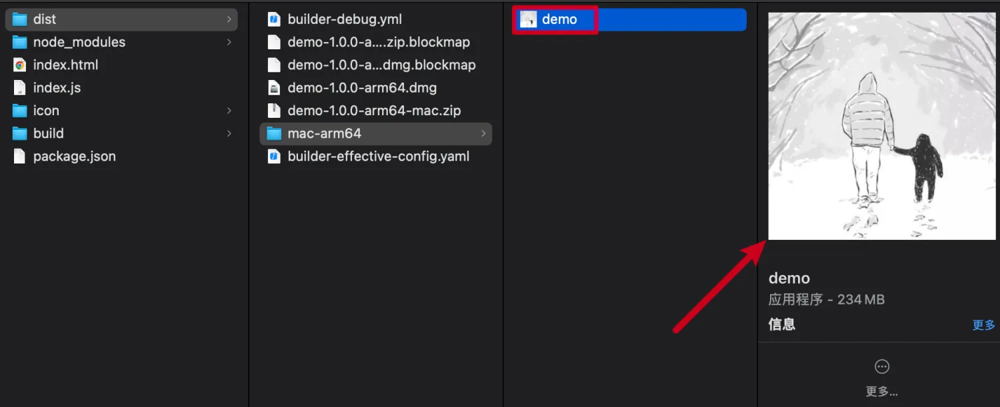
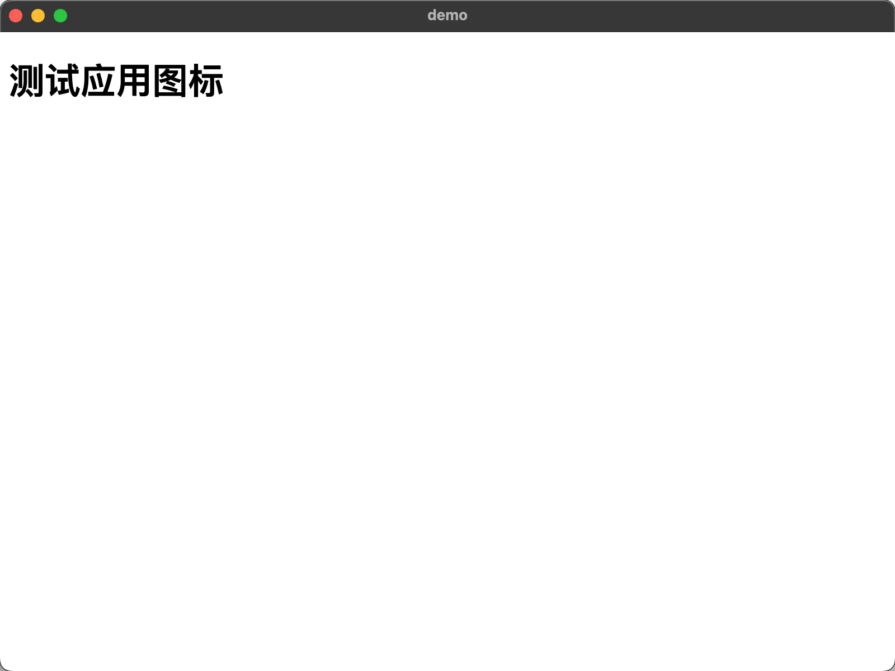

# [0030. 使用 electron-icon-builder、electron-builder 解决应用打包后的图标问题](https://github.com/Tdahuyou/electron/tree/main/0030.%20%E4%BD%BF%E7%94%A8%20electron-icon-builder%E3%80%81electron-builder%20%E8%A7%A3%E5%86%B3%E5%BA%94%E7%94%A8%E6%89%93%E5%8C%85%E5%90%8E%E7%9A%84%E5%9B%BE%E6%A0%87%E9%97%AE%E9%A2%98)

<!-- region:toc -->
- [1. 📝 summary](#1--summary)
- [2. 💻 demo](#2--demo)
- [3. 📒electron, electron-builder, 和 electron-icon-builder 应该安装为开发依赖还是生产依赖呢？](#3-electron,-electron-builder,-和-electron-icon-builder-应该安装为开发依赖还是生产依赖呢)
<!-- endregion:toc -->
## 1. 📝 summary
- 使用 electron-icon-builder 处理应用图标
- 使用 electron-builder 出包

## 2. 💻 demo

- 需要事前准备一张 .png 图片，比如你可以随便截一张你的头像来测试。

```json
// package.json
{
  "name": "demo",
  "version": "1.0.0",
  "description": "",
  "main": "index.js",
  "scripts": {
    "test": "echo \"Error: no test specified\" && exit 1",
    "generate-icon": "electron-icon-builder --input=./icon/icon.png --output=./build",
    "build": "npm run generate-icon && electron-builder"
  },
  "author": "",
  "license": "ISC",
  "devDependencies": {
    "electron": "^29.1.6",
    "electron-builder": "^24.13.3",
    "electron-icon-builder": "^2.0.1"
  },
  "build": {
    "appId": "this_is_your_application_id",
    "mac": {
      "icon": "build/icons/mac/icon.icns"
    },
    "win": {
      "icon": "build/icons/win/icon.ico"
    },
    "linux": {
      "icon": "build/icons/png/"
    }
  }
}
```

- 
  - `npm run generate-icon` 将 icon 目录下的 icon.png 图片转为不同操作系统的应用图标文件，并丢到 build 目录中。命令成功执行后，你将在 build 目录中看到生成的图标。

```json
"build": {
  "appId": "this_is_your_application_id",
  "mac": {
    "icon": "build/icons/mac/icon.icns"
  },
  "win": {
    "icon": "build/icons/win/icon.ico"
  },
  "linux": {
    "icon": "build/icons/png/"
  }
}
```

- build 字段的内容，配置的是 electron-builder 的一些编译选项，主要作用是告诉 electron-builder 咱们的 electron 应用图标所在的位置，并对不同的操作系统环境做了区分。

```js
// index.js
const { app, BrowserWindow } = require('electron')

app.whenReady().then(() => {
  new BrowserWindow().loadFile('index.html')
})
```

```html
<!-- index.html -->
<!DOCTYPE html>
<html lang="en">
<head>
  <meta charset="UTF-8">
  <meta name="viewport" content="width=device-width, initial-scale=1.0">
</head>
<body>
  <h1>测试应用图标</h1>
</body>
</html>
```

- 主进程和渲染进程中没有添加任何逻辑，就是一个空壳。
- **最终效果**
  - `npm run build` 这是出包命令。
  - 下面是在 macos 上测试了一下打包的最终结果。当打包结束后，可以在 dist/mac-arm64 中找到构建产物，双击即可运行。
    - 
  - 运行后，你将看到下面这个窗口。
    - 
  - 与此同时，你会在 Dock 栏中看到你的应用程序。图标就是我们的事前准备好的图片。
    - 
- 该 demo 的做法是直接使用命令的方式来走，并将其配置到了包体描述文件 package.json 中。这部分的逻辑，其实也可以视作 nodejs 脚本，丢到一个 .js 文件中以便管理。

## 3. 📒electron, electron-builder, 和 electron-icon-builder 应该安装为开发依赖还是生产依赖呢？

- 答：开发依赖。
- 因此，当你编写的应用如果需要出包的话，别忘了在安装的这些包的时候加上 --save-dev 参数，否则，出包的时候会报错。
  - 
  - `⨯ Package "electron" is only allowed in "devDependencies". Please remove it from the "dependencies" section in your package.json.`
- 其中 electron-builder、electron-icon-builder 应该安装为开发依赖比较好理解，重点来看看 electron 为啥也应该安装为开发依赖。
- 当你使用如 electron-builder、electron-packager 等打包工具来构建你的 Electron 应用程序时，它们会将 Electron 运行时（runtime）及相关资源包含到最终的可执行文件或安装包中。也就是说，**打包工具会负责将 Electron 运行时及其相关资源加入到最终的产物中，你在开发阶段安装的 electron 包仅仅是在开发阶段起作用罢了，这也是为何将 electron 安装为开发依赖的原因。**