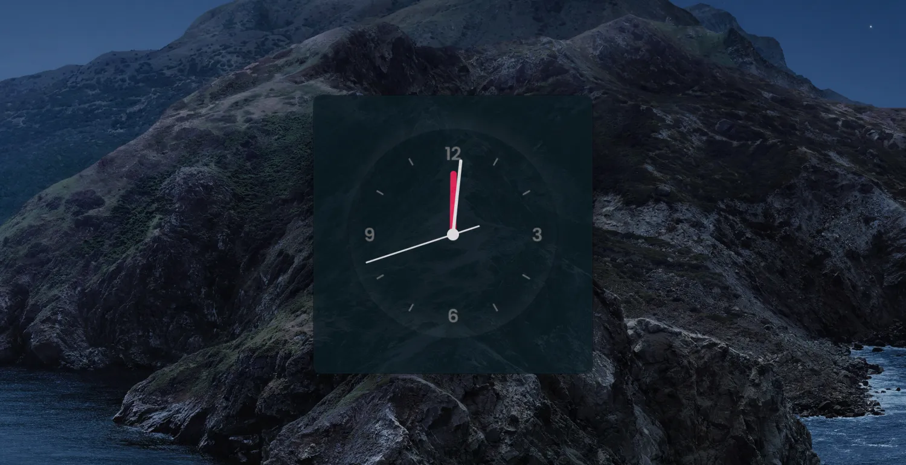

# [0032. 实现一个桌面时钟](https://github.com/Tdahuyou/electron/tree/main/0032.%20%E5%AE%9E%E7%8E%B0%E4%B8%80%E4%B8%AA%E6%A1%8C%E9%9D%A2%E6%97%B6%E9%92%9F)

<!-- region:toc -->
- [1. 🔗 links](#1--links)
- [2. 📒](#2-)
- [3. 💻 demo](#3--demo)
<!-- endregion:toc -->
- 手写一个简单的桌面时钟摆件
- 最终效果：
  - 

## 1. 🔗 links

- https://www.electronjs.org/zh/docs/latest/tutorial/window-customization#%E5%88%9B%E5%BB%BA%E7%82%B9%E5%87%BB%E7%A9%BF%E9%80%8F%E7%AA%97%E5%8F%A3
  - Electron，示例，创建点击穿透窗口。
- https://www.electronjs.org/zh/docs/latest/api/browser-window#winsetignoremouseeventsignore-options
  - win.setIgnoreMouseEvents

## 2. 📒

- 这个 demo 主要用来练习不规则窗口的实现，有几点细节需要注意。
  - 窗口默认是矩形，如果用户点击的区域是矩形的非表盘区域，需要可以穿透下去点击到窗口后面的内容。鼠标穿透的效果，需要用到一个 API win.setIgnoreMouseEvents。
  - 窗口的拖动问题除了使用 JS 来解决，还可以考虑使用 JS + CSS 来解决。

## 3. 💻 demo

```js
// index.js
const { app, BrowserWindow, ipcMain } = require('electron')

const createWindow = () => {
  const win = new BrowserWindow({
    width: 350,
    height: 350,
    transparent: true, // 设置窗口透明
    resizable: false, // 设置窗口不可缩放
    frame: false, // 隐藏窗口边框
    opacity: 0.8, // 设置窗口透明度

    webPreferences: {
      nodeIntegration: true,
      contextIsolation: false,
    },
  })

  win.loadFile('window/index.html')

  win.setAlwaysOnTop(true, 'pop-up-menu') // 设置窗口置顶
  win.setIgnoreMouseEvents(true) // 设置鼠标事件可以穿透【非表盘的圆形区域】
}

app.whenReady().then(createWindow)

ipcMain.on('setIgnoreMouseEvent', (e, ...args) => {
  BrowserWindow.fromWebContents(e.sender).setIgnoreMouseEvents(...args)
})
```

- 
- `setIgnoreMouseEvent` 这部分逻辑，主要是用于实现这样一个效果 —— 点击矩形窗口的非圆表盘区域，让鼠标可以穿透下去，点到位于窗口后边的内容。

```js
// window/index.js
const { ipcRenderer } = require('electron')

let isDragging = false
let offset = null

const dom_clock = document.querySelector('#clock')
const dom_hour = document.querySelector('.hour')
const dom_min = document.querySelector('.min')
const dom_sec = document.querySelector('.sec')

setInterval(() => {
  const now = new Date()

  dom_hour.style.transform = `rotateZ(${(now.getHours() + now.getMinutes() / 60) * (360 / 12)}deg)`
  dom_min.style.transform = `rotateZ(${now.getMinutes() * (360 / 60)}deg)`
  dom_sec.style.transform = `rotateZ(${now.getSeconds() * (360 / 60)}deg)`
}, 1000)

// 解决时钟挂件拖拽移动的问题
document.addEventListener('mousedown', (e) => {
  if (
    e.target.matches('.clock, .clock *') // 如果用户点击的是 .clock 元素或者 .clock 元素的子元素
  ) {
    isDragging = true
    offset = {
      x: e.screenX - window.screenX,
      y: e.screenY - window.screenY,
    }
  }
})

document.addEventListener('mousemove', (e) => {
  if (isDragging) {
    const { screenX, screenY } = e // 从最新的鼠标位置获取 x 和 y
    window.moveTo(screenX - offset.x, screenY - offset.y)
  }
})

document.addEventListener('mouseup', () => {
  isDragging = false // 用户停止拖拽
  offset = null // 重置偏移值
})

// 在鼠标进入到时钟区域的时候，我们要解除鼠标穿透
dom_clock.addEventListener('mouseenter', _ => ipcRenderer.send('setIgnoreMouseEvent', false))

// 在鼠标离开时钟区域的时候，我们要重新开启鼠标穿透
dom_clock.addEventListener('mouseleave', _ => ipcRenderer.send('setIgnoreMouseEvent', true, { forward: true }))
```

- `window.moveTo` 解决窗口的拖动问题。
- `dom_clock.addEventListener('mouseenter', fn)`、`dom_clock.addEventListener('mouseleave', fn)` 解决窗口的鼠标穿透问题。
- 最终效果：
- 


