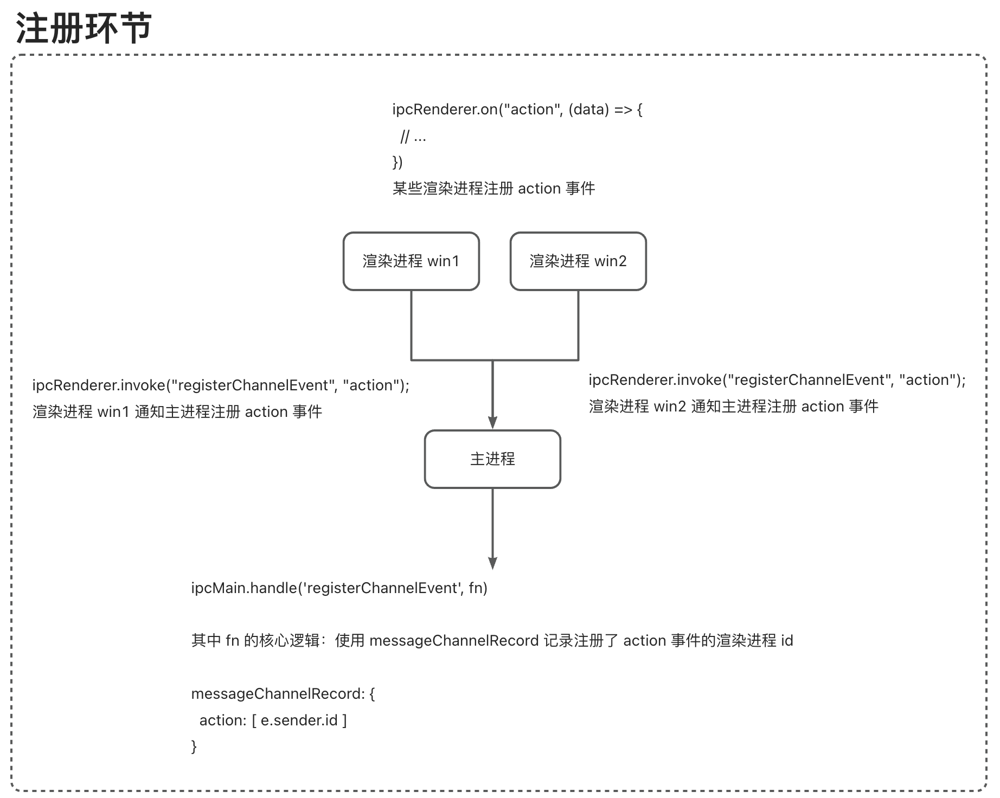
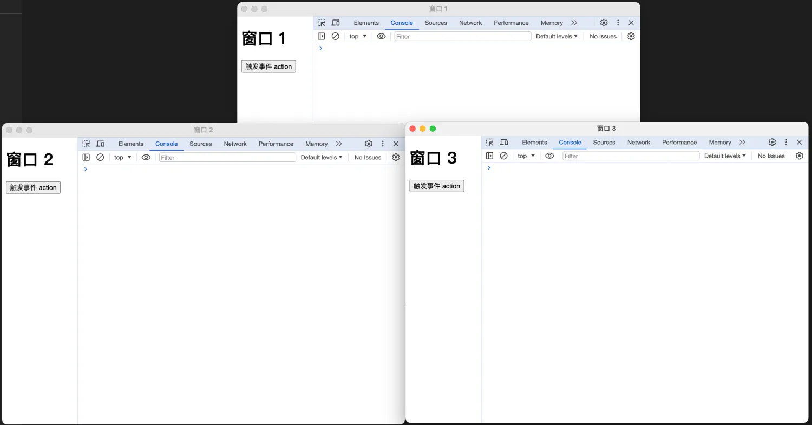
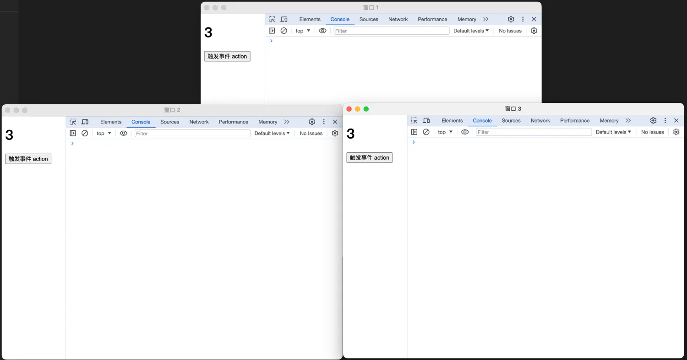

# [0034. 仿观察者模式实现两个渲染进程之间的互相通信](https://github.com/Tdahuyou/electron/tree/main/0034.%20%E4%BB%BF%E8%A7%82%E5%AF%9F%E8%80%85%E6%A8%A1%E5%BC%8F%E5%AE%9E%E7%8E%B0%E4%B8%A4%E4%B8%AA%E6%B8%B2%E6%9F%93%E8%BF%9B%E7%A8%8B%E4%B9%8B%E9%97%B4%E7%9A%84%E4%BA%92%E7%9B%B8%E9%80%9A%E4%BF%A1)

<!-- region:toc -->
- [1. 🔗 links](#1--links)
- [2. 💡 导图](#2--导图)
- [3. 💻 demo](#3--demo)
<!-- endregion:toc -->
- 理解事件注册流程
- 理解事件触发流程
- 原理简述
  - 主进程维护一个事件登记表 `messageChannelRecord`，需要监听 `action` 事件的渲染进程在页面加载完毕后立刻通知主进程，主进程记录 `action` 事件和对应渲染进程的 ID `e.sender.id`。当某个渲染触发 `action` 事件的时候，主进程根据记录的 ID 逐个去通知注册了该事件的渲染进程。
  - 其中 messageChannelRecord 的数据结构如下：
```js
const messageChannelRecord:Record<string, Electron.BrowserWindow.id[]>  = {}
messageChannelRecord['action'] = [ e.sender.id ]
// Electron.BrowserWindow.id 是 number 类型
```

## 1. 🔗 links

- https://www.electronjs.org/zh/docs/latest/api/browser-window#browserwindowfromidid
  - 查看官方文档对 BrowserWindow.fromId(id) 此 API 的描述。

## 2. 💡 导图

仿观察者模式，实现两个渲染进程之间的互相通信。记录了“观察者模式”下，注册环节和触发环节的流程。




## 3. 💻 demo

仿观察者设计模式，实现两个渲染进程之间的互相通信。

开始是想要直接在主进程中使用 nodejs 的 EventEmitter 模块来实现一个事件总线的效果，但测试时才意识到函数没法直接作为 IPC 的参数来传递，渲染进程的 func 还得放在渲染进程。于是想到通过让主进程来维护一张“事件 <-> 渲染进程 ID”的表，来模拟观察者模式实现通信。

这个 demo 并不完善，并没有加上移除事件的方法，仅仅是加了注册事件和触发事件的逻辑。

```js
// index.js
const { app, BrowserWindow, ipcMain } = require('electron')
const path = require('path')

const messageChannelRecord = {}

function createWindow(filePath) {
  const win = new BrowserWindow({
    webPreferences: {
      nodeIntegration: true,
      contextIsolation: false,
    },
  })

  win.loadFile(filePath)
  win.webContents.openDevTools()
}

function handleIPC () {
  ipcMain.handle('registerChannelEvent', (e, channel) => {
    // 注意：
    // e.senderer.id 是 win.webContents.id
    // BrowserWindow.fromWebContents(e.sender).id 是 win.id
    // 通过 BrowserWindow.fromId(ID) 来查询 BrowserWindow 实例，所需的 ID 是 win.id
    if (messageChannelRecord[channel]) {
      messageChannelRecord[channel].push(BrowserWindow.fromWebContents(e.sender).id)
    } else {
      messageChannelRecord[channel] = [BrowserWindow.fromWebContents(e.sender).id]
    }
    console.log('messageChannelRecord:', messageChannelRecord)
  })

  ipcMain.handle('emitterChannelEvent', (e, channel, data) => {
    console.log(BrowserWindow.getAllWindows().map(win => ({ winId: win.id, webContentsId: win.webContents.id })))
    if (messageChannelRecord[channel]) {
      messageChannelRecord[channel].forEach(id => {
        let win = BrowserWindow.fromId(id)
        if (win) {
          win.webContents.send(channel, data)
        }
      })
    }
  })
}

app.whenReady().then(() => {
  ;[
    path.join(__dirname, './renderer/win1/index.html'),
    path.join(__dirname, './renderer/win2/index.html'),
    path.join(__dirname, './renderer/win3/index.html'),
  ].forEach((filePath) => createWindow(filePath));
  handleIPC();
})
```


```js
// win1/index.js
const { ipcRenderer } = require('electron')

ipcRenderer.on('action', (e, data) => {
  document.querySelector('h1').innerHTML = data
})
ipcRenderer.invoke('registerChannelEvent', 'action')

document.getElementById('btn').addEventListener('click', () => {
  ipcRenderer.invoke('emitterChannelEvent', 'action', 1)
})
```


```js
// win2/index.js
const { ipcRenderer } = require('electron')

ipcRenderer.on('action', (e, data) => {
  document.querySelector('h1').innerHTML = data
})
ipcRenderer.invoke('registerChannelEvent', 'action')

document.getElementById('btn').addEventListener('click', () => {
  ipcRenderer.invoke('emitterChannelEvent', 'action', 2)
})
```


```js
// win3/index.js
const { ipcRenderer } = require('electron')

ipcRenderer.on('action', (e, data) => {
  document.querySelector('h1').innerHTML = data
})
ipcRenderer.invoke('registerChannelEvent', 'action')

document.getElementById('btn').addEventListener('click', () => {
  ipcRenderer.invoke('emitterChannelEvent', 'action', 3)
})
```

**最终效果**



点击【窗口 1】的按钮，所有窗口的 `<h1>` 的内容都变为 1。


点击【窗口 2】的按钮，所有窗口的 `<h1>` 的内容都变为 2。


点击【窗口 3】的按钮，所有窗口的 `<h1>` 的内容都变为 3。




