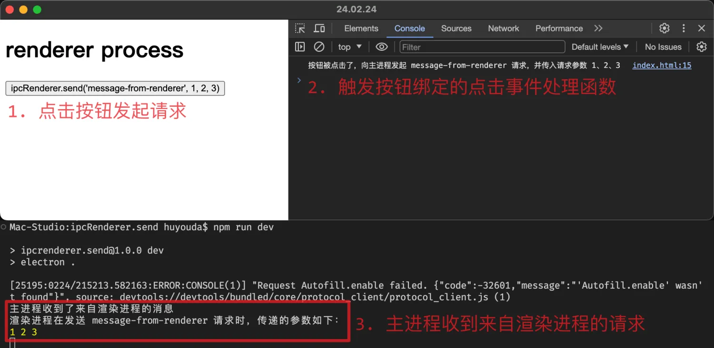

# [0037. 使用 ipcRenderer.send、ipcMain.on 实现从渲染进程到主进程的单向 IPC 通信](https://github.com/Tdahuyou/electron/tree/main/0037.%20%E4%BD%BF%E7%94%A8%20ipcRenderer.send%E3%80%81ipcMain.on%20%E5%AE%9E%E7%8E%B0%E4%BB%8E%E6%B8%B2%E6%9F%93%E8%BF%9B%E7%A8%8B%E5%88%B0%E4%B8%BB%E8%BF%9B%E7%A8%8B%E7%9A%84%E5%8D%95%E5%90%91%20IPC%20%E9%80%9A%E4%BF%A1)

<!-- region:toc -->
- [1. 📝 summary](#1--summary)
- [2. 💻 demo](#2--demo)
<!-- endregion:toc -->
## 1. 📝 summary
- [📺 bilibili](https://www.bilibili.com/video/BV1544219774)

## 2. 💻 demo

```js
// index.js
const { app, BrowserWindow, ipcMain } = require('electron')

let win
function createWindow() {
  win = new BrowserWindow({
    webPreferences: {
      nodeIntegration: true,
      contextIsolation: false,
    },
  })

  win.webContents.openDevTools()

  win.loadFile('./index.html')
}

function handleIPC() {
  ipcMain.on('message-from-renderer', (event, ...args) => {
    console.log('主进程收到了来自渲染进程的消息')
    console.log('渲染进程在发送 message-from-renderer 请求时，传递的参数如下：')
    console.log(...args)
  })
}

app.on('ready', () => {
  createWindow()
  handleIPC()
})
```

```html
<!-- index.html -->
<!DOCTYPE html>
<html lang="en">
<head>
  <meta charset="UTF-8">
  <meta http-equiv="X-UA-Compatible" content="IE=edge">
  <meta name="viewport" content="width=device-width, initial-scale=1.0">
  <title>24.02.24</title>
</head>
<body>
  <h1>renderer process</h1>
  <button id="btn">ipcRenderer.send('message-from-renderer', 1, 2, 3)</button>
  <script>
    const { ipcRenderer } = require('electron')
    document.getElementById('btn').addEventListener('click', () => {
      console.log('按钮被点击了，向主进程发起 message-from-renderer 请求，并传入请求参数 1、2、3')
      ipcRenderer.send('message-from-renderer', 1, 2, 3)
    })
  </script>
</body>
</html>
```

**最终效果**

渲染进程使用 ipcRenderer.send 发送消息给主进程，主进程通过 ipcMain.on 对渲染进程发送过来的消息进行监听，实现【渲染进程】到【主进程】的【单向 IPC 通信】。



