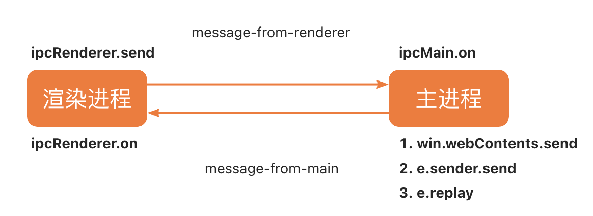

# [0038. 使用 ipcRenderer.send、ipcMain.on 实现主进程和渲染进程之间的双向 IPC 通信](https://github.com/Tdahuyou/electron/tree/main/0038.%20%E4%BD%BF%E7%94%A8%20ipcRenderer.send%E3%80%81ipcMain.on%20%E5%AE%9E%E7%8E%B0%E4%B8%BB%E8%BF%9B%E7%A8%8B%E5%92%8C%E6%B8%B2%E6%9F%93%E8%BF%9B%E7%A8%8B%E4%B9%8B%E9%97%B4%E7%9A%84%E5%8F%8C%E5%90%91%20IPC%20%E9%80%9A%E4%BF%A1)

<!-- region:toc -->


- [bilibili.electron.0038.1](https://www.bilibili.com/video/BV1CBFyeRE5w)
- [1. 📺 视频](#1--视频)
- [2. 💻 demo](#2--demo)
<!-- endregion:toc -->

## 1. 📺 视频

<BilibiliOutsidePlayer id="BV1CBFyeRE5w" />

## 2. 💻 demo

**通信原理图**



**源码实现**

```js
// renderer.js
const { ipcRenderer } = require('electron')

// 1. 按钮被点击
btn.onclick = () => {
  // 2. 渲染进程主动给主进程发 'message-from-renderer' 消息
  ipcRenderer.send('message-from-renderer', 1, 2, 3)
}

// 3. 渲染进程被动监听来自主进程的 'message-from-main' 消息
ipcRenderer.on('message-from-main', (_, res) => {
  console.log('receive message from main process', res)
})
```

```js
// index.js
const {app, BrowserWindow, ipcMain} = require('electron')

let win
function createWindow() {
  win = new BrowserWindow({
    webPreferences: { nodeIntegration: true, contextIsolation: false }
  })

  win.webContents.openDevTools()

  win.loadFile("./index.html")
}

function handleIPC() {
  // 1. 主进程被动监听来自渲染进程的 'message-from-renderer' 消息
  ipcMain.on('message-from-renderer', (event, ...args) => {
    console.log('receive message from renderer process', ...args)

    // 2. 执行求和功能
    const sum = args.reduce((a, b) => a + b, 0)

    // 3. 主进程处理完相应任务后，给渲染进程响应一个结果，主动给渲染进程发 'message-from-main' 消息。
    // win.webContents.send('message-from-main', sum) // A
    // event.sender.send('message-from-main', sum) // B
    event.reply('message-from-main', sum) // C

    // console.log(win.webContents === event.sender) // true
    // console.log(win.webContents.send === event.sender.send) // true

    // A B C 3 种写法都是等效的，都可以给渲染进程响应一个结果。
  })
}

app.on('ready', () => {
  createWindow()
  handleIPC()
})
```

**最终效果**

渲染进程通过 `ipcRenderer.send` 方法给主进程发消息，主进程通过 `ipcMain.on` 方法监听来自渲染进程的消息。主进程收到消息之后，通过 `win.webContents.send`、`e.senderer.send`、`e.replay` 其中一个方法给渲染进程回复消息，渲染进程通过 `ipcRenderer.on` 来接受来自主进程的消息。


```bash
# 主进程日志
receive message from renderer process 1 2 3
```


