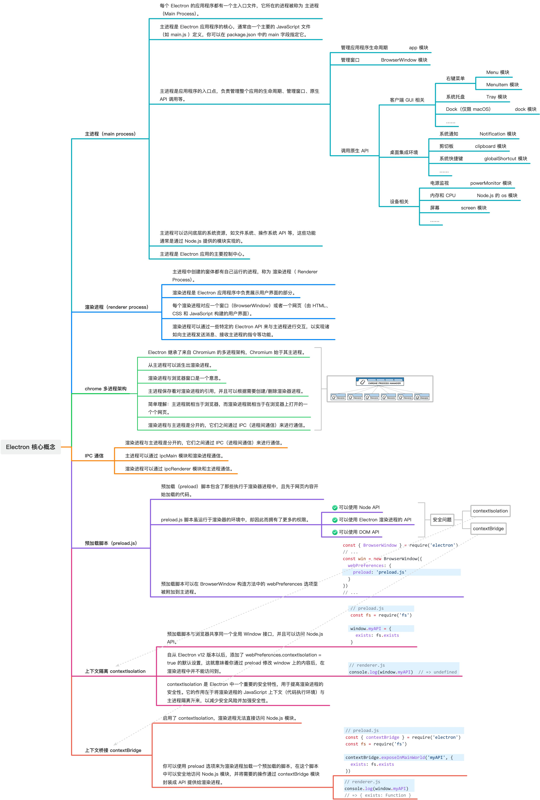

# [0045. Electron 核心概念](https://github.com/Tdahuyou/electron/tree/main/0045.%20Electron%20%E6%A0%B8%E5%BF%83%E6%A6%82%E5%BF%B5)

- 📝 summary
  - 主进程是什么
  - 渲染进程是什么
  - 主进程和渲染进程之间的差异
  - electron 的渲染进程（Web 页面）和我们传统的在浏览器端开发的 Web 页面有何区别
  - 上下文隔离 contextIsolation 是什么
  - 如何开启 contextIsolation 配置
  - 为什么建议始终开启 contextIsolation 配置
  - 上下文桥接 contextBridge 是什么
  - contextBridge 用来解决什么问题
  - 如何使用 contextBridge API 来给渲染进程暴露方法
  - 需要对 Electron 中的主进程和渲染进程有个初步的认知，在后续的学习中，Electron 的主进程和渲染进程将会是学习的重点内容。“Electron 的主进程”、“Electron 的渲染进程”这两组字眼，在接下来的学习中，会不断地被提及。本文档中提及的内容，仅仅是做一个初步的简单介绍罢了，通过多撸代码，慢慢加深对它们的理解。

## 🔗 链接

- https://www.electronjs.org/docs/latest/api/app - 在官网的 `API/Main Process Modules` 中查看 Electron 主进程都有哪些模块。
- https://www.electronjs.org/docs/latest/api/clipboard - 在官网的 `API/Renderer Process Modules` 中查看 Electron 渲染进程都有哪些模块。

## 💡 导图



> 内容较多，可以在 yuque 上查看。

## 📝 Electron 架构


在 Electron 中，进程模型主要包含两类进程：主进程、渲染进程。

1. **主进程**

Electron 的主进程是负责创建 GUI 窗口，管理应用程序事件和处理系统操作的进程，它可以调用 Electron 提供的大部分原生 API。

2. **渲染进程**

Electron 的渲染进程是运行在 BrowserWindow 实例中，负责渲染加载的 web 页面的进程，它只能使用一小部分 Electron API，对于需要系统权限的操作，需通过 IPC 与主进程进行通信。

- 每个 BrowserWindow 实例对应一个渲染进程，当 BrowserWindow 实例被销毁后，渲染进程也跟着终结。
- 这些渲染进程独立运行，互不影响。

## 📝 主进程 vs. 渲染进程
### 数量差异

【主进程】一个 Electron 应用只有 **一个** 主进程。

【渲染进程】一个 Electron 应用可以有 **多个** 渲染进程。

这就好比一个应用可以有多个页面，通过浏览器的标签页来类比会好理解很多。你电脑上运行的浏览器应用就是一个主进程，浏览器上允许你同时打开多个网页（多个渲染进程）。

### 作用差异

【主进程】

- 负责管理所有的窗口及其对应的渲染进程。
- 控制应用生命周期（app）。
- 管理原生 GUI，典型的窗口（BrowserWindow、Tray、Dock、Menu）。

【渲染进程】

- 负责渲染在 BrowserWindow 中加载（展示）的 Web 页面。
- 通过 Node.js、Electron 提供的 API 可以跟系统底层打交道。

### 模块差异

[**主进程**](https://www.electronjs.org/docs/latest/api/app) 模块通常用于实现 Electron 应用的核心功能，如：

- **进行进程间通信（ipcMain）**
- **创建窗口（BrowserWindow、BrowserView）**
- **管理应用程序生命周期（app）**
- 实现网络功能（net、netLog）
- **管理可交互的通知（Notification）**
- **获取屏幕信息（screen）**
- 实现系统偏好设置功能（systemPreferences）
- 原生 GUI（Menu、Tray、MenulItem）
- 加载我们具体的页面（webContents）
- 用来实现更新的模块（autoUpdater）
- 用来设置全局的一个快捷键（globalShortcut）
- …… 等等

这些模块通常需要更多的系统权限，因此只能在主进程中使用。


[**渲染进程**](https://www.electronjs.org/docs/latest/api/clipboard) 模块主要用于在渲染进程中实现特定功能，如：

- **进行进程间通信（ipcRenderer）**
- ~~远程调用主进程中的方法（remote）~~（remote 这模块早已被启用）
- 修改网页的布局和样式（webFrame）
- …… 等等

这些模块主要用于处理和渲染 Web 内容，因此只能在渲染进程中使用。

**公用的模块**

clipboard、crashReporter、nativeImage

这些模块可以在主进程和渲染进程中使用，主要提供一些基础和公用的功能，如：

- 模块访问剪贴板（clipboard）
- 报告崩溃信息（crashReporter）
- 创建原生图像（nativeImage）
- ……

因为这些功能在主进程和渲染进程中都可能需要，所以这些模块被设计为可以在两种进程中使用。

**注意**

以上的分类并不是绝对的，某些模块可能在主进程和渲染进程中的功能并不完全相同，或者在不同的环境或版本中能够访问的 API 可能有所不同。在实际使用时，我们应该参考 Electron 的官方文档以获取最准确的信息。

## 📝 contextBridge

### `contextIsolation` 是什么

`contextIsolation` 表示“上下文隔离”，它是 Electron 中的一个安全性相关的配置项，用于隔离渲染进程中的预加载（preload）脚本和网页内容，有助于防止跨站脚本攻击并提高应用的整体安全性。

在开发 Electron 应用时，强烈 **建议开启** `contextIsolation` 来确保应用安全。当 `contextIsolation` 设置为 `true` 时，它会创建一个安全的、隔离的 JavaScript 上下文环境，使得来自网页的代码无法访问预加载脚本中的 Node.js 功能和 Electron 的 API。这样的隔离机制可以显著提高应用的安全性，特别是在防止跨站脚本攻击（XSS）方面。

### `contextIsolation` 工作原理

当 `contextIsolation` 开启时，Electron 会为页面内容和预加载脚本创建两个独立的 JavaScript 上下文。这意味着网页内的脚本无法直接访问预加载脚本的全局变量或者 Node.js 的环境，反之亦然。

要在这种模式下在网页和预加载脚本之间通信，需要使用 `contextBridge` API。`contextBridge` 允许开发者在这两个上下文之间安全地暴露方法和属性，而不会破坏隔离层。

### 为什么要使用 `contextIsolation`

**增强安全性**：通过隔离页面内容和预加载脚本，即使网页内容受到 XSS 攻击，攻击者也无法直接访问 Node.js 环境或 Electron 的 API，从而 **限制了攻击的影响范围**。

**避免全局污染**：由于页面脚本和预加载脚本在不同的上下文中执行，它们的全局变量不会互相影响，这 **有助于避免意外的全局变量污染**。

**更清晰的代码隔离**：`contextIsolation` 促使开发者显式地通过 `contextBridge` 定义哪些功能是需要在网页中暴露的，有助于更好地组织代码，明确不同脚本间的交互界面。

### 如何配置 `contextIsolation`

在 Electron 应用中，`contextIsolation` 通常在创建 `BrowserWindow` 时通过 `webPreferences` 选项进行配置：

```javascript
const { BrowserWindow } = require('electron')

let win = new BrowserWindow({
  webPreferences: {
    contextIsolation: true,
    // 开启 contextIsolation
    preload: 'path/to/preload/script'
  }
})
```

将 `contextIsolation` 设置为 `true` 并指定预加载脚本路径可以确保预加载脚本和页面内容在隔离的环境中执行，增强应用的安全性。

### 小结

`contextIsolation` 主要是为了解决安全方面的问题，但是安全往往意味着诸多的限制，这些限制不仅针对外来的攻击者，对于开发者来说也是一样的。所以在有些时候，为了图方便，我们会刻意将这个配置给关闭掉。

## 📝 contextBridge 上下文桥接

`contextIsolation`、`contextBridge` 这俩玩意儿主要作用都是处理安全方面的问题。前者将环境给完全隔离，后者在完全隔离的环境中去接通一些 API 的访问权限。

### `contextBridge` 是什么

`contextBridge` 是 Electron 中的一个 API，它 **用于在开启了 `contextIsolation` 的情况下，安全地在渲染进程的预加载脚本和网页内容之间共享资源和数据**。

由于 `contextIsolation` 会创建一个隔离的 JavaScript 上下文环境，直接在网页内容中访问 Node.js 功能和 Electron API 将不再可能。这时，`contextBridge` 就显得尤为重要，因为它提供了一种安全的方法在预加载脚本 `preload.js` 中给渲染进程暴露那些需要在网页中运行时使用的功能。

### `contextBridge` 工作原理

`contextBridge` 通过其 `exposeInMainWorld` 方法允许预加载脚本在网页的全局作用域中 **安全地暴露 API**。这样做的好处是即使在隔离的上下文中，网页的 JavaScript 代码也可以调用这些 API，而不会直接接触到预加载脚本的作用域或 Node.js 的环境，从而保持了安全性和隔离性。

### `contextBridge` 基本使用

在预加载脚本中，你可以使用 `contextBridge.exposeInMainWorld` 方法来暴露函数或对象给渲染进程。

```javascript
const { contextBridge } = require('electron')

// 暴露 API 给渲染进程
contextBridge.exposeInMainWorld('myAPI', {
  doSomething: () => console.log('Doing something in the main world!')
})
```

然后，网页中的 JavaScript 代码就可以通过 `window.myAPI.doSomething()` 调用这个函数。

## 🤔 问：渲染进程中的 remote 模块是？

答：don't care，你就当 remote 模块不存在即可。

在渲染进程中提到了一嘴 remote 模块，它已是弃子。因种种原因，在 Electron 中很早就已经被抛弃掉了。

Q：remote 模块有什么用？

A：它能够让你在渲染进程中直接访问主进程才能访问的模块。

Q：remote 模块这么方便，为什么把 remote 模块丢弃掉呢？

A：存在很多潜在问题，和 Electron 设计理念不符。

Q：如果我就是想要使用 remote 模块呢？

A：有办法通过第三方库来引入，但不建议这么做。

## 🤔 问：Electron 中的渲染进程也是网页，那么它和我们在浏览器中开发的网页有何区别？

答：相较而言，Electron 中的页面，能做事儿更多。

**【浏览器中的网页】**

浏览器中的 Web 页面是运行在 **沙盒环境** 中的，**无法访问操作系统的原生资源**。

**【Electron 中的网页】**

Electron 可以让我们使用 Node.js 的 API，享用 Node.js 的丰富生态库，并且可以访问系统的 Native API，调用系统的原生 GUI 等。

## 🤔 问：IPC 通信是什么？

在 Electron 中，IPC（**Inter-Process Communication**）进程间通信是一种机制，它允许主进程（Main Process）和渲染进程（Renderer Process）互相发送和接收消息，以实现信息交换和协同工作。

## 🤔 问：为什么需要 IPC 通信呢？

因为 **主进程和渲染进程有各自的职责和权限**，IPC 允许这两种进程进行信息交换和协同工作，以实现应用的完整功能。

简单讲，就是两点原因：

「有些事儿，主进程能做，但是渲染进程不能做。」

「有些事儿，主进程不能做，但是渲染进程能做。」

我们的应用程序的一些功能，需要两个进程之间相互配合才能完成，因此，我们需要通过 IPC 通信的方式，来实现不同进程之间的互相“交流”。

你或许还会问，为什么不能一个进程把所有事儿全做了呢？这个问题就涉及到操作系统的设计层面了，有那个精力的话，你可以去了解下系统为何如此设计。这里可以简单提一嘴，有个印象就行。在现代操作系统和应用程序设计中，使用多进程架构是出于“安全性”、“稳定性”和“资源管理”等多方面的考虑。至于其中的细节就不多说啦，因为现在我也不会 ～

## 🤔 问：为什么 Electron 要将主进程和渲染进程分开呢？

因为这么设计，可以保证每个浏览器窗口（渲染进程、页面）的独立性和稳定性，同时也有利于提高应用程序的安全性（**只有主进程才能访问系统级别的资源和操作**）。


Electron 架构中主进程对系统级别的资源和操作的独特访问权限主要是出于安全和稳定性的考虑：

- **安全性**：限制对系统级别资源和操作的访问可以防止恶意代码或者攻击对系统级别资源造成破坏。例如，如果一个 Electron 应用的渲染进程被某种形式的恶意代码利用，那么该恶意代码的破坏范围将被限制在该渲染进程内，而无法直接对系统级资源造成更大的影响。
- **稳定性**：将系统级操作限制在主进程中，可以防止渲染进程由于运行错误或者崩溃而影响到系统级别的操作。例如，如果一个渲染进程因为某种原因崩溃了，那么主进程和其他渲染进程可以继续运行，应用程序的其他部分不会受到影响。

## 🤔 问：主进程向渲染进程发消息，是向页面发吗？

答：并不是，而是向具体的 BrowserWindow 实例发，具体得看这个实例加载的是哪个页面。所以说，如果一个页面被多个实例都引用了，只有对应的实例才能收到消息，虽然它们都是同一个页面。

## 🤔 问：为什么要使用 `contextBridge`

**安全性**：`contextBridge` 提供了一种安全的机制来在渲染进程的不同上下文之间共享方法和对象，减少了直接暴露 Node.js 功能和 Electron API 给网页可能带来的安全风险。

**上下文隔离**：即使在开启了 `contextIsolation` 的情况下，`contextBridge` 也能够保持网页内容与预加载脚本之间的互操作性，而不会牺牲安全性。

**清晰的 API 设计**：通过 `contextBridge` 暴露给网页的 API，可以使得 API 设计更加清晰和有组织，有助于维护代码的可读性和可维护性。
