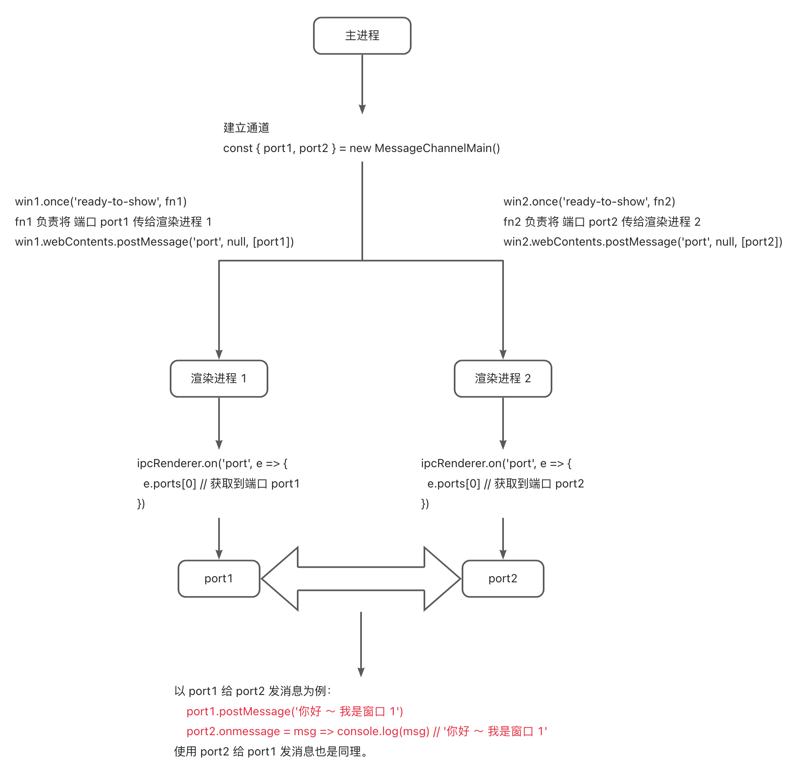

# [0047. 分析渲染进程之间的通信](https://github.com/Tdahuyou/electron/tree/main/0047.%20%E5%88%86%E6%9E%90%E6%B8%B2%E6%9F%93%E8%BF%9B%E7%A8%8B%E4%B9%8B%E9%97%B4%E7%9A%84%E9%80%9A%E4%BF%A1)

<!-- region:toc -->
- [1. 🔗 官方文档 > Electron 中的消息端口](#1--官方文档--electron-中的消息端口)
- [2. 📒 错误做法 ❌](#2--错误做法-)
- [3. 📒 主进程转发消息](#3--主进程转发消息)
- [4. 📒 主进程转发 ID](#4--主进程转发-id)
- [5. 📒 走消息端口](#5--走消息端口)
<!-- endregion:toc -->
- 主进程转发消息
- 主进程转发 ID
- 消息端口
- 通过笔记中的时序图来介绍了两个渲染进程之间通信的一种方式 —— 借助主进程来转发消息。
- 相关实现示例，见后续文档中对应的 demo。
- 这篇笔记中画的几张图，在后续的 demo 的视频介绍中有被反复提及。

## 1. 🔗 官方文档 > Electron 中的消息端口

- https://www.electronjs.org/zh/docs/latest/tutorial/message-ports

## 2. 📒 错误做法 ❌

```mermaid
sequenceDiagram
      participant renderer1
      participant renderer2
      renderer1->>renderer2: 嘿，告诉我 1 + 2 的结果
      renderer2->>renderer1: 好的，结果是 3
			Note over renderer1,renderer2: 错误
```

- 在 Electron 中，主进程只能有一个，但是渲染进程可以有多个，并且每个渲染进程之间是相互独立的，也就是说渲染进程和渲染进程之间互相并不知道彼此的存在，那么又何谈渲染进程之间的通信呢？
- 这时候就需要依赖主进程了，如果你想要实现渲染进程之间的互相通信。

## 3. 📒 主进程转发消息

```mermaid
sequenceDiagram
      participant renderer1
		  participant main
      participant renderer2
      renderer1->>main: 嘿，我需要 renderer2 告诉我 1 + 2 的结果
			main->>renderer2: renderer1 询问你 1 + 2 的结果
      renderer2->>main: 好的，结果是 3
			main->>renderer1: 结果是 3
			Note over renderer1,renderer2: 正确
```

- 让主进程来帮你做转发消息。
- electron.0042 这个笔记中的 demo1、demo2 使用的都是这种通信方式。

## 4. 📒 主进程转发 ID

```mermaid
sequenceDiagram
      participant renderer1
		  participant main
      participant renderer2
      renderer1->>main: 嘿，请告诉我 renderer2 的 ID，我需要跟它通信。
			main->>renderer1: renderer2 的 ID 是 xxx
      renderer1->>renderer2: 嘿，ID 为 xxx 的请告诉我 1 + 2 的结果
			renderer2->>renderer1: 结果是 3
			Note over renderer1,renderer2: 正确
```

- 让主进程告诉你，你想要与之通信的那个渲染进程的 ID，然后你再根据 ID 来给指定的渲染进程发消息。
- electron.0041 该笔记中的 demo 采用的是这种通信方式。
- 上述两种方式都可以实现渲染进程之间的 **间接** 相互通信。在后续的内容中，我们将结合具体的示例来看看代码实现。

## 5. 📒 走消息端口

- 使用 **Electron 中的消息端口** 来实现两个渲染进程之间的通信。
- electron.0040 该笔记中的 demo 介绍了这种方式实现的详细步骤。

