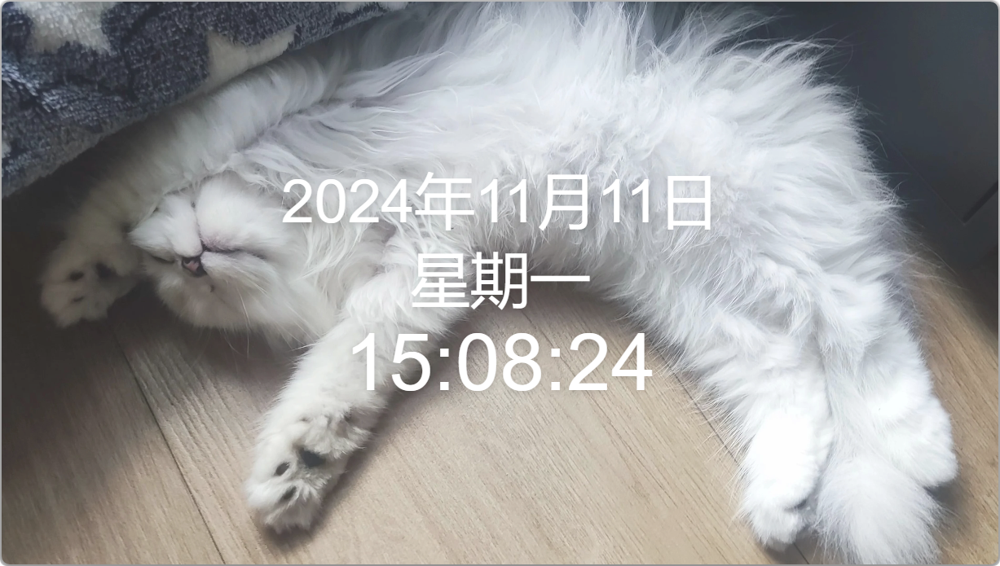
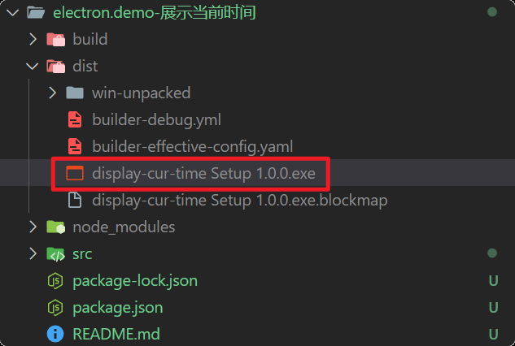
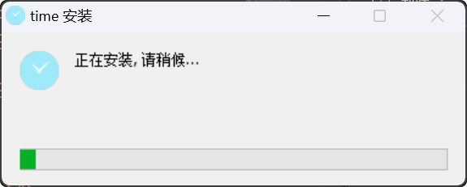

# [0056. 实现一个桌面时钟-2](https://github.com/Tdahuyou/electron/tree/main/0056.%20%E5%AE%9E%E7%8E%B0%E4%B8%80%E4%B8%AA%E6%A1%8C%E9%9D%A2%E6%97%B6%E9%92%9F-2)

<!-- region:toc -->
- [1. 📒 demo 功能简介](#1--demo-功能简介)
- [2. 📒 编写这个 demo 的初衷](#2--编写这个-demo-的初衷)
- [3. 📒 启动 `npm start` 和出包 `npm run build`](#3--启动-npm-start-和出包-npm-run-build)
- [4. 📒 图标背景色 `#9feaf9`](#4--图标背景色-9feaf9)
<!-- endregion:toc -->
- 从 0 到 1 实现一个简易的桌面时钟应用。
- 一共没几行代码，直接看 src 下边的源码即可。
- 在 0032 也练习了一个桌面时钟的应用，0032 是一个桌面时钟摆件，展示效果是以钟表形式来呈现的。

## 1. 📒 demo 功能简介

- 可自定义背景图（`src/week.jpeg` 目前放的是我家的猫）
- 可自定义透明度（`src/main.js` 直接修改 `opacity: 0.88` 来自定义透明度）
- 可自定义应用程序的图标（`src/icon.png` 这是应用图标）
- 可自定义应用程序的名称（`package.json` 中的 `"name": "display-cur-time"` 这一部分指定的是应用程序名称）
- 时间字体具备响应式 - 随着窗口尺寸变化而变化（`src/index.html` 更多和页面样式相关的内容，可以直接修改这里边的 style）
- ……其他更多功能（可以学习更多的前端技术栈来扩展 demo 的功能）

## 2. 📒 编写这个 demo 的初衷

- 录制一些分享视频的时候，开头习惯性地会读一些当前的时间，没找到在 macOS 上展示当前时间的好方案，于是使用 electron 写了一个建议版的桌面时钟 demo。

## 3. 📒 启动 `npm start` 和出包 `npm run build`

- 启动后看到的效果：
  - 

```bash
$ npm run build

# > display-cur-time@1.0.0 build
# > npm run generate-icon && electron-builder


# > display-cur-time@1.0.0 generate-icon
# > electron-icon-builder --input=./src/icon.png --output=./build

# Created C:\Users\Tdahuyou\Desktop\notes\temp_\electron.demo-展示当前时间\build\icons\png\16.png
# Created C:\Users\Tdahuyou\Desktop\notes\temp_\electron.demo-展示当前时间\build\icons\png\24.png
# Created C:\Users\Tdahuyou\Desktop\notes\temp_\electron.demo-展示当前时间\build\icons\png\32.png
# Created C:\Users\Tdahuyou\Desktop\notes\temp_\electron.demo-展示当前时间\build\icons\png\48.png
# Created C:\Users\Tdahuyou\Desktop\notes\temp_\electron.demo-展示当前时间\build\icons\png\64.png
# Created C:\Users\Tdahuyou\Desktop\notes\temp_\electron.demo-展示当前时间\build\icons\png\128.png
# Created C:\Users\Tdahuyou\Desktop\notes\temp_\electron.demo-展示当前时间\build\icons\png\256.png
# Created C:\Users\Tdahuyou\Desktop\notes\temp_\electron.demo-展示当前时间\build\icons\png\512.png
# Created C:\Users\Tdahuyou\Desktop\notes\temp_\electron.demo-展示当前时间\build\icons\png\1024.png
# Icon generator from PNG:
#   src: C:\Users\Tdahuyou\Desktop\notes\temp_\electron.demo-展示当前时间\build\icons\png
#   dir: C:\Users\Tdahuyou\Desktop\notes\temp_\electron.demo-展示当前时间\build\icons\mac
# ICNS:
#   Create: C:\Users\Tdahuyou\Desktop\notes\temp_\electron.demo-展示当前时间\build\icons\mac\icon.icns
# Icon generator from PNG:
#   src: C:\Users\Tdahuyou\Desktop\notes\temp_\electron.demo-展示当前时间\build\icons\png
#   dir: C:\Users\Tdahuyou\Desktop\notes\temp_\electron.demo-展示当前时间\build\icons\win
# ICO:
#   Create: C:\Users\Tdahuyou\Desktop\notes\temp_\electron.demo-展示当前时间\build\icons\win\icon.ico
# Renaming PNGs to Electron Format
# Renamed 16.png to 16x16.png
# Renamed 24.png to 24x24.png
# Renamed 32.png to 32x32.png
# Renamed 48.png to 48x48.png
# Renamed 64.png to 64x64.png
# Renamed 128.png to 128x128.png
# Renamed 256.png to 256x256.png
# Renamed 512.png to 512x512.png
# Renamed 1024.png to 1024x1024.png

#  ALL DONE
#   • electron-builder  version=25.1.8 os=10.0.22631
#   • loaded configuration  file=package.json ("build" field)
#   • description is missed in the package.json  appPackageFile=C:\Users\Tdahuyou\Desktop\notes\temp_\electron.demo-展示当前时间\package.json
#   • writing effective config  file=dist\builder-effective-config.yaml
#   • executing @electron/rebuild  electronVersion=33.2.0 arch=x64 buildFromSource=false appDir=./
#   • installing native dependencies  arch=x64
#   • completed installing native dependencies
#   • packaging       platform=win32 arch=x64 electron=33.2.0 appOutDir=dist\win-unpacked
#   • downloading     url=https://github.com/electron/electron/releases/download/v33.2.0/electron-v33.2.0-win32-x64.zip size=115 MB parts=8
#   • downloaded      url=https://github.com/electron/electron/releases/download/v33.2.0/electron-v33.2.0-win32-x64.zip duration=29.161s
#   • updating asar integrity executable resource  executablePath=dist\win-unpacked\display-cur-time.exe
#   • signing with signtool.exe  path=dist\win-unpacked\display-cur-time.exe
#   • no signing info identified, signing is skipped  signHook=false cscInfo=null
#   • building        target=nsis file=dist\display-cur-time Setup 1.0.0.exe archs=x64 oneClick=true perMachine=false
#   • signing with signtool.exe  path=dist\win-unpacked\resources\elevate.exe
#   • no signing info identified, signing is skipped  signHook=false cscInfo=null
#   • signing with signtool.exe  path=dist\__uninstaller-nsis-display-cur-time.exe
#   • no signing info identified, signing is skipped  signHook=false cscInfo=null
#   • signing with signtool.exe  path=dist\display-cur-time Setup 1.0.0.exe
#   • no signing info identified, signing is skipped  signHook=false cscInfo=null
#   • building block map  blockMapFile=dist\display-cur-time Setup 1.0.0.exe.blockmap
```

- 在 Windows 下最终生成的打包产物：
  - 
    - `package.json` 中的 `"name": "display-cur-time"` 这一部分指定的是应用程序名称。比如可以将 `"name": "display-cur-time"` 改为  `"name": "time"`，那么生成的应用程序名称就为 `time`。
  - 双击运行这个安装程序。
  - 
  - 完成安装之后，会在桌面上自动生成该应用的快捷方式。
  - 

## 4. 📒 图标背景色 `#9feaf9`

- `#9feaf9` 这个背景色是从当前（2024年11月11日15:15:26）的 Electron 官方文档中吸过来的主题色。
  - 


