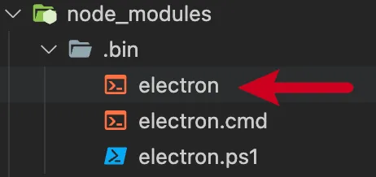
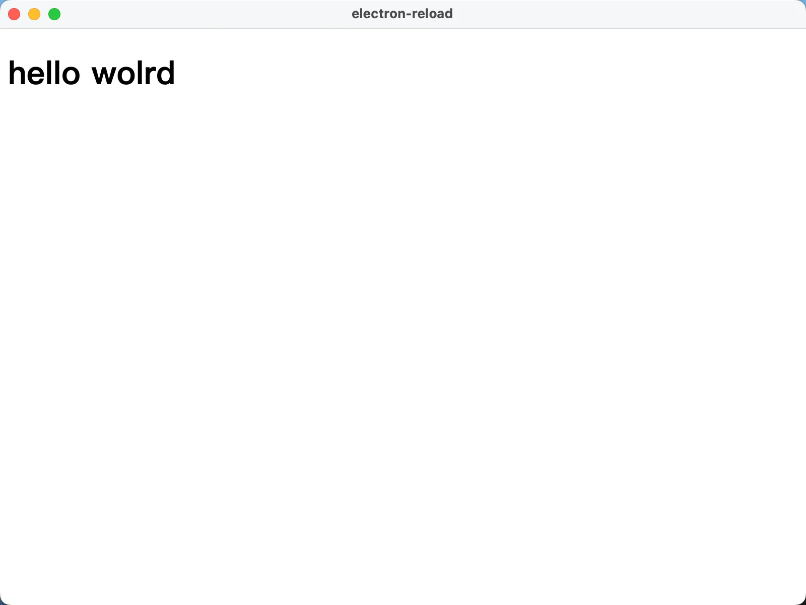
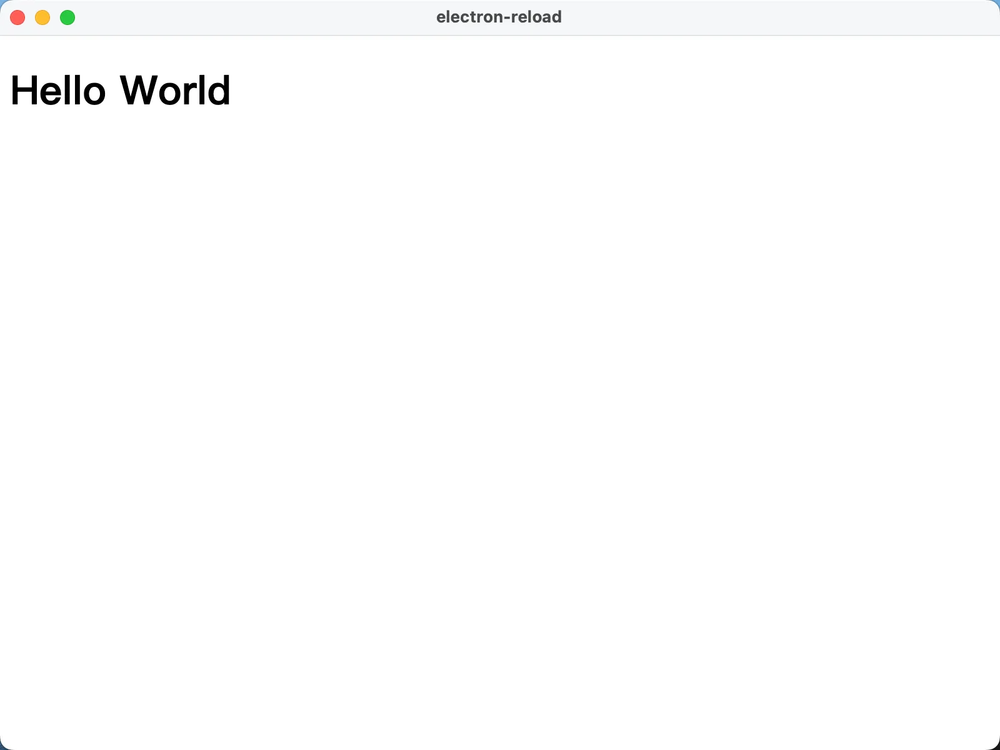

# [0031. 使用 electron-reload 实现热更](https://github.com/Tdahuyou/TNotes.electron/tree/main/notes/0031.%20%E4%BD%BF%E7%94%A8%20electron-reload%20%E5%AE%9E%E7%8E%B0%E7%83%AD%E6%9B%B4)


<!-- region:toc -->

- [1. 📺 视频](#1--视频)
- [2. 🔗 links](#2--links)
- [3. 💻 demo](#3--demo)

<!-- endregion:toc -->
- 如何使用 electron-reload 实现热更
- 使用 electron-reload 监听主进程和渲染进程内容的变更，一旦内容变化，就自动重启 electron。
- 额，这功能确实有点儿用，不过感觉也是可有可无，因为手动启动的成本也不算太高。

## 1. 📺 视频

<BilibiliOutsidePlayer id="BV1kBFyeREDD" />

## 2. 🔗 links

- https://github.com/yan-foto/electron-reload#readme
  - 开源库 electron-reload 的 github 首页，在线查看这个库的基本使用说明。

> TODO：看了眼仓库源码，貌似量也不多，可以找时间看看实现原理。

## 3. 💻 demo


```json
// package.json
{
  "name": "electron-reload",
  "version": "1.0.0",
  "description": "",
  "main": "index.js",
  "scripts": {
    "test": "echo \"Error: no test specified\" && exit 1",
    "dev": "electron ."
  },
  "author": "",
  "license": "ISC",
  "dependencies": {
    "electron": "^29.1.4",
    "electron-reload": "^2.0.0-alpha.1"
  }
}
```

```js
// index.js
const { app, BrowserWindow } = require('electron')
const path = require('path')

require('electron-reload')(__dirname, {
  electron: path.join(__dirname, 'node_modules', '.bin', 'electron')
})

app.whenReady().then(() => {
  const win = new BrowserWindow({
    x: 0,
    y: 0,
  })
  win.loadFile('./index.html')
})
```

- `require('electron-reload')` 引入 electron-reload。
- `require('electron-reload')(__dirname, ...)` 告诉 electron-reload 我们工作目录的位置，让它知道监听哪一部分的内容。
- `electron: path.join(__dirname, 'node_modules', '.bin', 'electron')` 告诉 electron-reload，我们安装的 electron 可执行程序所在的位置。
  - 
- **最终效果**
  - 不太好描述，建议结合视频来看会更加直观一些。
  - 【主进程】
    - 修改主进程 index.js 的内容，保存之后，electron-reload 会自动热更。将之前的 electron 干掉，然后基于我们的修改，起一个新的 electron 应用。
    - 比如，在使用 new BrowserWindow({x: 0, y: 0}) 去实例化一个窗口时，会在桌面左上角新建一个窗口。我们可以将 {x: 0, y: 0} 这一部分配置项给注释掉，然后保存，新建的窗口将会出现在默认位置，也就是屏幕的中心区域。
    - 
  - 【渲染进程】
    - 这种热更的机制不仅仅限于主进程的变更，就此 demo 而言，对于渲染进程 index.html 也是有效的。
    - 比如，可以将 hello world 改成 Hello World，修改完之后保存，页面内容会自动更新。此时并不会重新起一个 electron 应用，而是基于已有的应用来更新的，效果类似于 ctrl r 强行刷新一下窗口。
    - 
