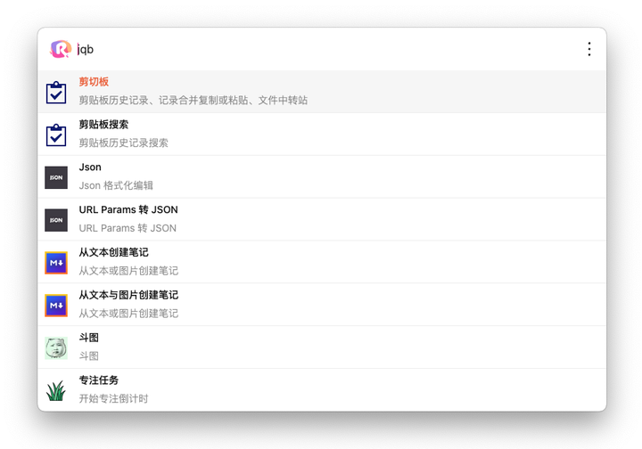

# [0051. 掘金小册 - 《Electron 应用开发实践指南》](https://github.com/Tdahuyou/TNotes.electron/tree/main/notes/0051.%20%E6%8E%98%E9%87%91%E5%B0%8F%E5%86%8C%20-%20%E3%80%8AElectron%20%E5%BA%94%E7%94%A8%E5%BC%80%E5%8F%91%E5%AE%9E%E8%B7%B5%E6%8C%87%E5%8D%97%E3%80%8B)

<!-- region:toc -->

- [1. 📝 概述](#1--概述)
- [2. 📒 小册目录](#2--小册目录)
- [3. 📒 rubick 简介](#3--rubick-简介)
- [4. 🔗 References](#4--references)

<!-- endregion:toc -->

## 1. 📝 概述

- 介绍了一个 Electron 在线教程 - 掘金小册 - 《Electron 应用开发实践指南》。
- 该小册是一个付费内容。
- **个人推广链接**
  - https://s.juejin.cn/ds/iBAwjM5s/
  - 这是《Electron 应用开发实践指南》的个人推广链接。
  - 如果有需要的话，可以通过上述推广链接下单支持一下（有几块钱的推广费）。感谢 🙏 🙏 🙏

## 2. 📒 小册目录

```txt
1. 开篇：Electron 带来的边界扩展
2. 基础篇：Electron 的基础概念
3. 基础篇：Electron 进程间的通信
4. 基础篇：Electron 的原生能力
5. 基础篇：Electron 跨平台兼容性措施
6. 基础篇：Electron 菜单和托盘
7. 实战篇：需求概述
8. 实战篇：开发环境搭建
9. 实战篇：自定义窗口的拖拽和缩放
10. 实战篇：实现应用快速检索
11. 实战篇：如何支持工具插件化
12. 实战篇：插件的安装、发布、卸载
13. 实战篇：系统插件的加载和取色插件的开发
14. 实战篇：Electron 实现屏幕截图
15. 实战：Electron 应用注入到系统右键菜单
16. 实战篇：实现超级面板
17. 实战篇：本地数据库和多端数据同步
18. 通用篇：使用 Rust 开发 Electron 原生扩展
19. 通用篇：Electron 应用打包
20. 通用篇：Electron 应用更新
21. 通用篇：Electron 应用性能优化
22. 通用篇：Electron 应用安全性指南
23. 通用篇：Electron 应用的自动化测试
24. 通用篇：Electron 的一些疑难杂症
25. 结语：我与 Electron &开源的那些事
```

## 3. 📒 rubick 简介

- 《Electron 应用开发实践指南》 这本小册的作者，是开源项目 [rubick](https://github.com/rubickCenter/rubick) 的作者。
- rubick 是一款插件化的工具箱，可以把 rubick 类比成微信；插件就是微信小程序。rubick 就是一个运行插件的容器，插件由三方开发者开发维护，不属于 rubick 主程序部分。
  - 
  - 左侧是输入框，输入内容后可以自动匹配对应插件或者系统应用 app，点击图片可以打开功能菜单-插件市场
  - 右侧 ... 是菜单项，有 2 个功能项
    - 固定/取消固定主窗口
    - 切换语言
- 如果你用过类似 utools 这样的工具，会发现它们是非常类似的，不过 utools 貌似有些功能是需要付费的，而 rubick 是开源的。

## 4. 🔗 References

::: details

- https://github.com/rubickCenter/rubick
  - GitHub rubick 仓库。
- https://rubickcenter.github.io/docs/
  - rubick 官方文档。

:::
